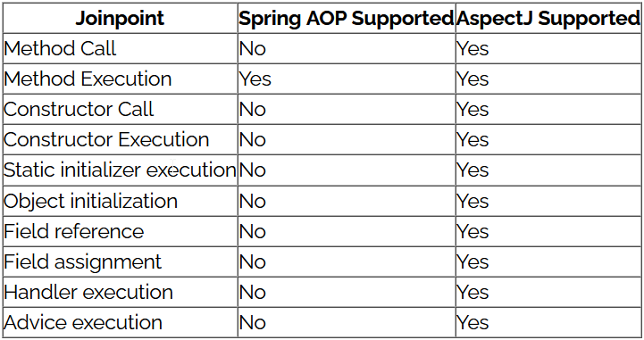
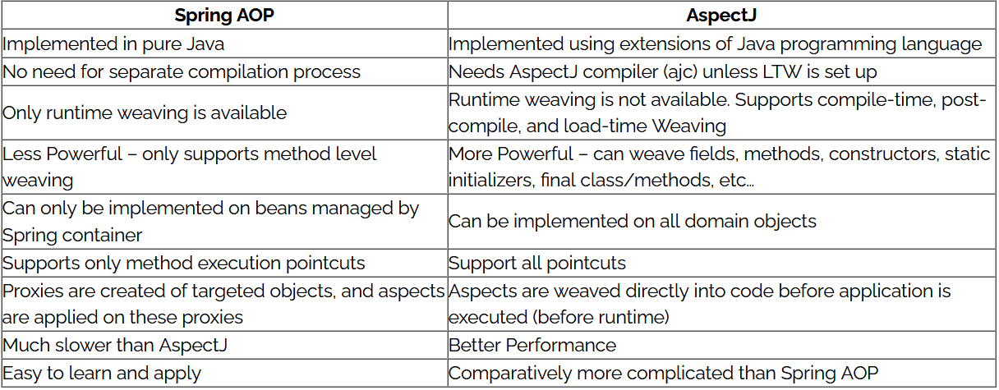

 [Go to Contents](index.md)

## Spring AOP - AspectJ

As AspectJ uses compile time and classload time weaving, Spring AOP makes use of runtime weaving.

1. **Aspect**: cross cutting concerns...
   Concerns (tasks, functionalities) are conceptually separate from the application’s business logic but cut
   across multiple types and objects in an OOP application.
   1. logging (e.g. performance logging)
   2. security
   3. transaction management
   4. caching
   5. etc.
2. Joint Point - a point during the execution of a program, such such as the execution of a method or the handling of an exception.
3. Advice - An Advice is an action taken by an aspect at a particular Joinpoint. Different types of advice include “around,” “before,” and “after.”
In Spring, an Advice is modelled as an interceptor, maintaining a chain of interceptors around the Joinpoint.
   1. Before
   2. After
   3. After throwing 
   4. After finally - after "After" and "After Throwing" advices
   5. Around
4. Pointcut - A Pointcut is a predicate that helps match an Advice to be applied by an Aspect at a particular JoinPoint.
We often associate the Advice with a Pointcut expression, and it runs at any Joinpoint matched by the Pointcut.
5. Custom Annotation
6. Pointcut Designators
   
* Spring AOP is based on proxy patterns. Because of this, it needs to subclass the targeted Java class and apply cross-cutting concerns accordingly.
* But it comes with a limitation. We cannot apply cross-cutting concerns (or aspects) across classes that are “final” because they cannot be overridden and thus it would result in a runtime exception.
* The same applies for static and final methods. Spring aspects cannot be applied to them because they cannot be overridden. Hence Spring AOP because of these limitations, only supports method execution join points.
* However, AspectJ weaves the cross-cutting concerns directly into the actual code before runtime. Unlike Spring AOP, it doesn't require to subclass the targetted object and thus supports many others joinpoints as well. Following is the summary of supported joinpoints:

* It's also worth noting that in Spring AOP, aspects aren't applied to the method called within the same class.
That's obviously because when we call a method within the same class, then we aren't calling the method of the proxy that Spring AOP supplies. If we need this functionality, then we do have to define a separate method in different beans, or use AspectJ.

### Performance

As far as performance is concerned, compile-time weaving is much faster than runtime weaving. Spring AOP is a proxy-based framework, so there is the creation of proxies at the time of application startup. Also, there are a few more method invocations per aspect, which affects the performance negatively.

On the other hand, AspectJ weaves the aspects into the main code before the application executes and thus there's no additional runtime overhead, unlike Spring AOP.

For these reasons, the benchmarks suggest that AspectJ is almost around 8 to 35 times faster than Spring AOP.

TODO: Add Code samples 