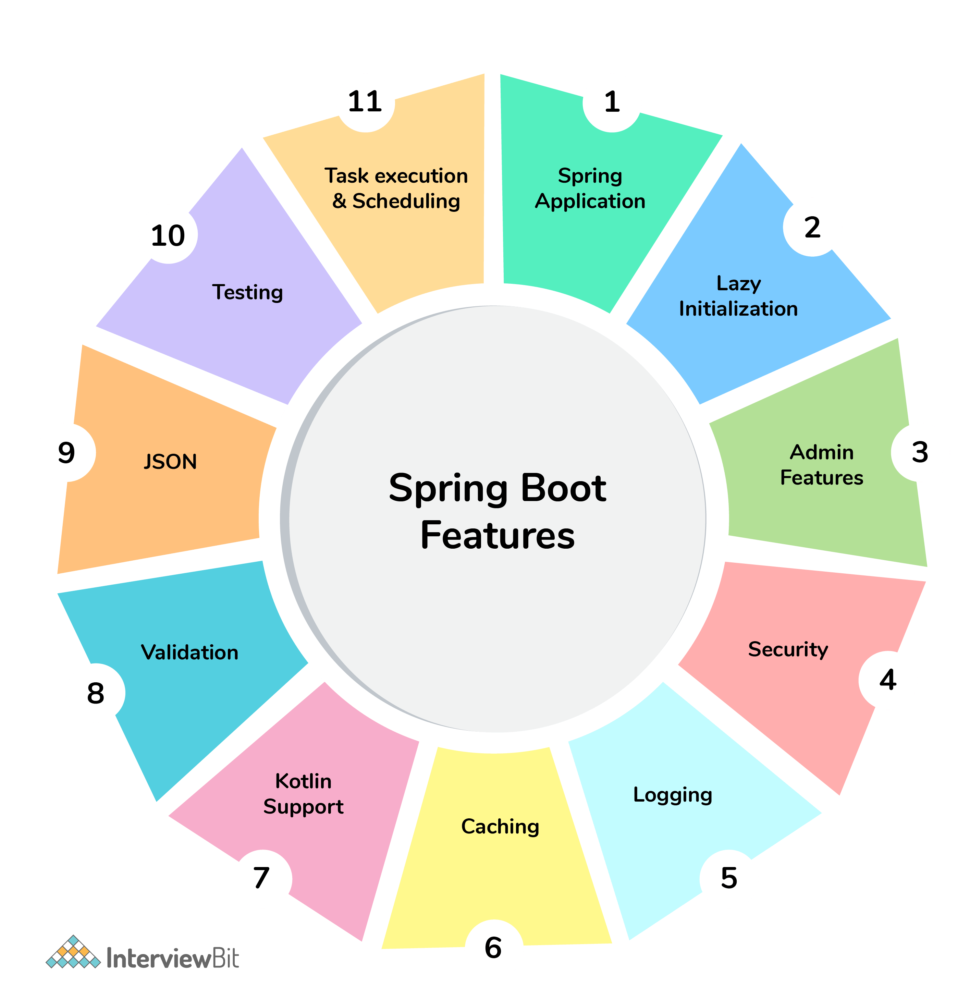

[](index.md) [Go to Contents](index.md)

## Spring Boot
Spring Boot is basically an extension of the Spring framework, which eliminates the boilerplate configurations required for setting up a Spring application.

It takes an opinionated view of the Spring platform, which paves the way for a faster and more efficient development ecosystem.

Here are just a few of the features in Spring Boot:

    Opinionated ‘starter' dependencies to simplify the build and application configuration
    Embedded server to avoid complexity in application deployment
    Metrics, Health check, and externalized configuration
    Automatic config for Spring functionality – whenever possible



### Basics
1. Booting from the Web
   1. Use a plugin within your IDE
   2. Use start.spring.io
2. [Auto-configuration](https://www.baeldung.com/spring-boot-annotations#enable-autoconfiguration) - a way to automatically configure an application based on the dependencies present on the classpath
   1. @EnableAutoconfiguration
   2. **@ConditionalOnClass** and **@ConditionalOnMissingClass** - Using these conditions, Spring will only use the marked auto-configuration bean if the class in the annotation's argument is present/absent.
   3. **@ConditionalOnBean** and **@ConditionalOnMissingBean** - We can use these annotations when we want to define conditions based on the presence or absence of a specific bean
   4. **@ConditionalOnProperty** - With this annotation, we can make conditions on the values of properties
   5. **@ConditionalOnResource** - We can make Spring to use a definition only when a specific resource is present
   6. **@ConditionalOnWebApplication** and **@ConditionalOnNotWebApplication** - 
      With these annotations, we can create conditions based on if the current application is or isn't a web application
   7. **@ConditionalExpression**
      We can use this annotation in more complex situations. Spring will use the marked definition when the SpEL expression is evaluated to true.
      ````
      @Bean
      @ConditionalOnExpression("${usemysql} && ${mysqlserver == 'local'}")
      DataSource dataSource() {
      // ...
      }
      ````
   8. **@Conditional** - 
      For even more complex conditions, we can create a class evaluating the custom condition. We tell Spring to use this custom condition with @Conditional
3. Configuring in Spring Boot
   1. Property based configurations
      1. application.properties or application.yaml
      2. Environment variables
      3. Command lines parameters
      4. Cloud configs (Config Server, Consul)
4. Spring Profiles in Boot - Profiles are a core feature of the framework — allowing us to map our beans to different profiles — for example, dev, test, and prod.
   We can then activate different profiles in different environments to bootstrap only the beans we need.
5. 

      
       


### Questions
Spring Boot Interview Questions For Freshers
1. What are the advantages of using Spring Boot?
   1. The advantages of Spring Boot are listed below:
      1. Easy to understand and develop spring applications.
      2. Spring Boot is nothing but an existing framework with the addition of an embedded HTTP server and annotation configuration which makes it easier to understand and faster the process of development.
      3. Increases productivity and reduces development time.
      4. Minimum configuration.
      5. We don’t need to write any XML configuration, only a few annotations are required to do the configuration.

2. What are the Spring Boot key components?
   1. Below are the four key components of spring-boot:
      * Spring Boot auto-configuration.
      * Spring Boot CLI.
      * Spring Boot starter POMs.
      * Spring Boot Actuators.

3. Why Spring Boot over Spring?
   1. Below are some key points which spring boot offers but spring doesn’t:
      * Starter POM.
      * Version Management.
      * Auto Configuration.
      * Component Scanning.
      * Embedded server.
      * InMemory DB.
      * Actuators
      * Spring Boot simplifies the spring feature for the user

4. What is the starter dependency of the Spring boot module?
   1. Spring boot provides numbers of starter dependency, here are the most commonly used -
      * Data JPA starter.
      * Test Starter.
      * Security starter.
      * Web starter.
      * Mail starter.
      * Thymeleaf starter.

5. How does Spring Boot works?
   1. Spring Boot automatically configures your application based on the dependencies you have added to 
   the project by using annotation. The entry point of the spring boot application is the class that contains
   @SpringBootApplication annotation and the main method.<br>
   Spring Boot automatically scans all the components included in the project by using @ComponentScan annotation.

6. What does the @SpringBootApplication annotation do internally?
   1. The @SpringBootApplication annotation is equivalent to using @Configuration, @EnableAutoConfiguration, and @ComponentScan with their default attributes. Spring Boot enables the developer to use a single annotation instead of using multiple. But, as we know, Spring provided loosely coupled features that we can use for each annotation as per our project needs.

7. What is the purpose of using @ComponentScan in the class files?
   1. Spring Boot application scans all the beans and package declarations when the application initializes. You need to add the @ComponentScan annotation for your class file to scan your components added to your project.

8. How does a spring boot application get started?
   1. Just like any other Java program, a Spring Boot application must have a main method. This method serves as an entry point, which invokes the SpringApplication#run method to bootstrap the application.

    ```@SpringBootApplication
    public class MyApplication {
    
           public static void main(String[] args) {    
        
                 SpringApplication.run(MyApplication.class);        
                   // other statements     
           } 
    }
    ```
   
9. What are starter dependencies?
   1. Spring boot starter is a maven template that contains a collection of all the relevant transitive dependencies that are needed to start a particular functionality.
      Like we need to import spring-boot-starter-web dependency for creating a web application.

   ```
   <dependency>
       <groupId> org.springframework.boot</groupId>
       <artifactId> spring-boot-starter-web </artifactId>
   </dependency>
   ```
10. What is Spring Initializer?
    1. Spring Initializer is a web application that helps you to create an initial spring boot project structure and provides a maven or gradle file to build your code. It solves the problem of setting up a framework when you are starting a project from scratch.

11. What is Spring Boot CLI and what are its benefits?
    1. Spring Boot CLI is a command-line interface that allows you to create a spring-based java application using Groovy.
    >Example: You don’t need to create getter and setter method or access modifier, return statement. If you use the JDBC template, it automatically loads for you.

12. What are the most common Spring Boot CLI commands?
    1. >-run, -test, -grap, -jar, -war, -install, -uninstall, --init, -shell, -help.

    
###Advanced Spring Boot Questions
13. What Are the Basic Annotations that Spring Boot Offers?
    1. The primary annotations that Spring Boot offers reside in its org.springframework.boot.autoconfigure and its sub-packages. Here are a couple of basic ones:
    2. @EnableAutoConfiguration – to make Spring Boot look for auto-configuration beans on its classpath and automatically apply them.
    3. @SpringBootApplication – used to denote the main class of a Boot Application. This annotation combines @Configuration, @EnableAutoConfiguration, and @ComponentScan annotations with their default attributes.

14. What is Spring Boot dependency management?
    1. Spring Boot dependency management is used to manage dependencies and configuration automatically without you specifying the version for any of that dependencies.

15. Can we create a non-web application in Spring Boot?
    1. Yes, we can create a non-web application by removing the web dependencies from the classpath along with changing the way Spring Boot creates the application context.

16. Is it possible to change the port of the embedded Tomcat server in Spring Boot?
    1. Yes, it is possible. By using the server.port in the application.properties.

17. What is the default port of tomcat in spring boot?
    1. The default port of the tomcat server-id 8080. It can be changed by adding sever.port properties in the application.property file.

18. Can we override or replace the Embedded tomcat server in Spring Boot?
    1. Yes, we can replace the Embedded Tomcat server with any server by using the Starter dependency in the pom.xml file. Like you can use spring-boot-starter-jetty as a dependency for using a jetty server in your project.

19. Can we disable the default web server in the Spring boot application?
    1. Yes, we can use application.properties to configure the web application type i.e spring.main.web-application-type=none.

20. How to disable a specific auto-configuration class?
    1. You can use exclude attribute of @EnableAutoConfiguration if you want auto-configuration not to apply to any specific class.
       ```
       //use of exclude
       @EnableAutoConfiguration(exclude={className})
       ```
       
21. Explain @RestController annotation in Sprint boot?
    1. It is a combination of `@Controller` and `@ResponseBody`, used for creating a restful controller. 
    It converts the response to JSON or XML. It ensures that data returned by each method will be written 
    straight into the response body instead of returning a template.

22. What is the difference between `@RestController` and `@Controller` in Spring Boot?
    1. @Controller Map of the model object to view or template and make it human readable,
    but @RestController simply returns the object and object data is directly written in HTTP response 
    as JSON or XML.

23. Describe the flow of HTTPS requests through the Spring Boot application?
    1. On a high-level spring boot application follow the MVC pattern which is depicted in the below flow diagram.

24. What is the CommandLineRunner?
    1. `CommandLineRunner` is a simple Spring Boot interface with a run method. Spring Boot will automatically call the run method of all beans implementing this interface after the application context has been loaded.
    2. We should also specify the `spring.main.web-application-type=NONE` Spring property. This property will explicitly inform Spring that this isn't a web application.


####Spring Boot Flow Architecture
24. What is the difference between RequestMapping and GetMapping?
    1. RequestMapping can be used with GET, POST, PUT, and many other request methods using the method attribute 
    on the annotation. Whereas getMapping is only an extension of RequestMapping which helps you to improve on
    clarity on request.

25. What is the use of Profiles in spring boot?
    1. While developing the application we deal with multiple environments such as dev, QA, Prod, and each 
    environment requires a different configuration. For eg., we might be using an embedded H2 database for dev
    but for prod, we might have proprietary Oracle or DB2. Even if DBMS is the same across the environment,
    the URLs will be different.
    <br>
    To make this easy and clean, Spring has the provision of Profiles to keep the separate configuration of environments.

26. What is Spring Actuator? What are its advantages?
    1. An actuator is an additional feature of Spring that helps you to monitor and manage your application
    when you push it to production. These actuators include auditing, health, CPU usage, HTTP hits,
    and metric gathering, and many more that are automatically applied to your application.

27. How to enable Actuator in Spring boot application?
    To enable the spring actuator feature, we need to add the dependency of “spring-boot-starter-actuator” in pom.xml.

    ```
    <dependency>
        <groupId> org.springframework.boot</groupId>
        <artifactId> spring-boot-starter-actuator </artifactId>
    </dependency>
    ```
28. What are the actuator-provided endpoints used for monitoring the Spring boot application?
    1. Actuators provide below pre-defined endpoints to monitor our application -
       * Health
       * Info
       * Beans
       * Mappings
       * Configprops
       * Httptrace
       * Heapdump
       * Threaddump
       * Shutdown

29. How to get the list of all the beans in your Spring boot application?
    1. Spring Boot actuator “/Beans” is used to get the list of all the spring beans in your application.

30. How to check the environment properties in your Spring boot application?
    1. Spring Boot actuator “/env” returns the list of all the environment properties of running the spring boot application.

31. How to enable debugging log in the spring boot application?
    1. Debugging logs can be enabled in three ways -
       * We can start the application with --debug switch.
       * We can set the logging.level.root=debug property in application.property file.
       * We can set the logging level of the root logger to debug in the supplied logging configuration file.

32. Where do we define properties in the Spring Boot application?
    1. You can define both application and Spring boot-related properties into a file called application.properties.
    You can create this file manually or use Spring Initializer to create this file.
    You don’t need to do any special configuration to instruct Spring Boot to load this file,
    If it exists in classpath then spring boot automatically loads it and configure itself and the application 
    code accordingly.

33. What is dependency Injection?
    1. The process of injecting dependent bean objects into target bean objects is called dependency injection.
       * Setter Injection: The IOC container will inject the dependent bean object into the target bean object by calling the setter method.
       * Constructor Injection: The IOC container will inject the dependent bean object into the target bean object by calling the target bean constructor.
       * Field Injection: The IOC container will inject the dependent bean object into the target bean object by Reflection API.

34. What is an IOC container?
    1. IoC Container is a framework for implementing automatic dependency injection. 
    It manages object creation and its life-time and also injects dependencies into the class.


### Questions 2

1. What Is Spring Boot and What Are Its Main Features?
   1. Spring Boot is essentially a framework for rapid application development built on top of the Spring Framework. With its auto-configuration and embedded application server support, combined with the extensive documentation and community support it enjoys, Spring Boot is one of the most popular technologies in the Java ecosystem as of date. 
   2. Here are a few salient features:
      * [Starters](https://www.baeldung.com/spring-boot-starters) – a set of dependency descriptors to include relevant dependencies at a go
      * [Auto-configuration](https://www.baeldung.com/spring-boot-annotations#enable-autoconfiguration) – a way to automatically configure an application based on the dependencies present on the classpath
      * [Actuator](https://www.baeldung.com/spring-boot-actuators) – to get production-ready features such as monitoring
      * [Security](https://www.baeldung.com/security-spring)
      * [Logging](https://www.baeldung.com/spring-boot-logging)

Q2. What Are the Differences Between Spring and Spring Boot?

The Spring Framework provides multiple features that make the development of web applications easier. These features include dependency injection, data binding, aspect-oriented programming, data access and many more.

Over the years, Spring has been growing more and more complex, and the amount of configuration such application requires can be intimidating. This is where Spring Boot comes in handy — it makes configuring a Spring application a breeze.

Essentially, while Spring is unopinionated, **Spring Boot takes an opinionated view of the platform and libraries, letting us get started quickly**.

Here are two of the most important benefits Spring Boot brings in:

* Auto-configure applications based on the artifacts it finds on the classpath
* Provide non-functional features common to applications in production, such as security or health checks
Please check out our other tutorial for a [detailed comparison between vanilla Spring and Spring Boot](https://www.baeldung.com/spring-vs-spring-boot).

Q3. How Can We Set Up a Spring Boot Application With Maven?

We can include Spring Boot in a Maven project just like we would any other library. However, the best way is to inherit from the spring-boot-starter-parent project and declare dependencies to Spring Boot starters. Doing this lets our project reuse the default settings of Spring Boot.

Inheriting the spring-boot-starter-parent project is straightforward — we only need to specify a parent element in pom.xml:
```
<parent>
    <groupId>org.springframework.boot</groupId>
    <artifactId>spring-boot-starter-parent</artifactId>
    <version>2.4.0.RELEASE</version>
</parent>
```
We can find the latest version of spring-boot-starter-parent on [Maven Central](https://search.maven.org/search?q=g:org.springframework.boot%20AND%20a:spring-boot-starter-parent&core=gav).

**Using the starter parent project is convenient but not always feasible.** For instance, if our company requires all projects to inherit from a standard POM, we can still benefit from Spring Boot's dependency management using a custom parent.

Q4. What Is Spring Initializr?

Spring Initializr is a convenient way to create a Spring Boot project.

We can go to the [Spring Initializr](https://start.spring.io/) site, choose a dependency management tool (either Maven or Gradle), a language (Java, Kotlin or Groovy), a packaging scheme (Jar or War), version and dependencies, and download the project.

This **creates a skeleton project for us** and saves setup time so that we can concentrate on adding business logic.

Even when we use our IDE's (such as STS or Eclipse with STS plugin) new project wizard to create a Spring Boot project, it uses Spring Initializr under the hood.

Q5. What Spring Boot Starters Are Available Out There?

Each starter plays a role as a one-stop shop for all the Spring technologies we need. Other required dependencies are then transitively pulled in and managed in a consistent way.

All starters are under the org.springframework.boot group and their names start with spring-boot-starter-. 
**This naming pattern makes it easy to find starters, especially when working with IDEs that support searching dependencies by name.**

At the time of this writing, there are more than 50 starters at our disposal. Here, we'll list the most common:
* spring-boot-starter: core starter, including auto-configuration support, logging and YAML
* spring-boot-starter-aop: for aspect-oriented programming with Spring AOP and AspectJ
* spring-boot-starter-data-jpa: for using Spring Data JPA with Hibernate
* spring-boot-starter-security: for using Spring Security
* spring-boot-starter-test: for testing Spring Boot applications
* spring-boot-starter-web: for building web, including RESTful, applications using Spring MVC
For a complete list of starters, please see [this repository](https://github.com/spring-projects/spring-boot/tree/master/spring-boot-project/spring-boot-starters).

To find more information about Spring Boot starters, take a look at [Intro to Spring Boot Starters](https://www.baeldung.com/spring-boot-starters).

Q6. How to Disable a Specific Auto-Configuration?

If we want to disable a specific auto-configuration, we can indicate it using the exclude attribute of the @EnableAutoConfiguration annotation.

For instance, this code snippet neutralizes DataSourceAutoConfiguration:

```// other annotations
@EnableAutoConfiguration(exclude = DataSourceAutoConfiguration.class)
public class MyConfiguration { }
```
If we enabled auto-configuration with the @SpringBootApplication annotation — which has @EnableAutoConfiguration as a meta-annotation — we could disable auto-configuration with an attribute of the same name:

```// other annotations
@SpringBootApplication(exclude = DataSourceAutoConfiguration.class)
public class MyConfiguration { }
```
We can also disable an auto-configuration with the spring.autoconfigure.exclude environment property. This setting in the application.properties file does the same thing as before:

```
spring.autoconfigure.exclude=org.springframework.boot.autoconfigure.jdbc.DataSourceAutoConfiguration
```

Q7. How to Register a Custom Auto-Configuration?

To register an auto-configuration class, we must have its fully qualified name listed under the EnableAutoConfiguration key in the META-INF/spring.factories file:

```
org.springframework.boot.autoconfigure.EnableAutoConfiguration=com.baeldung.autoconfigure.CustomAutoConfiguration
```
If we build a project with Maven, that file should be placed in the resources/META-INF directory, which will end up in the mentioned location during the package phase.

Q8. How to Tell an Auto-Configuration to Back Away When a Bean Exists?
To instruct an auto-configuration class to back off when a bean already exists, we can use the @ConditionalOnMissingBean annotation.

The most noticeable attributes of this annotation are:

value – the types of beans to be checked
name – the names of beans to be checked
When placed on a method adorned with @Bean, the target type defaults to the method's return type:

```@Configuration
public class CustomConfiguration {
@Bean
@ConditionalOnMissingBean
public CustomService service() { ... }
}
```

Q9. How to Deploy Spring Boot Web Applications as Jar and War Files?

Traditionally, we package a web application as a WAR file and then deploy it into an external server. Doing this allows us to arrange multiple applications on the same server. When CPU and memory were scarce, this was a great way to save resources.

But things have changed. Computer hardware is fairly cheap now, and the attention has turned to server configuration. A small mistake in configuring the server during deployment may lead to catastrophic consequences.

**Spring tackles this problem by providing a plugin, namely spring-boot-maven-plugin, to package a web application as an executable JAR.**

To include this plugin, just add a plugin element to pom.xml:

```
<plugin>
    <groupId>org.springframework.boot</groupId>
    <artifactId>spring-boot-maven-plugin</artifactId>
</plugin>
```
With this plugin in place, we'll get a fat JAR after executing the package phase. This JAR contains all the necessary dependencies, including an embedded server. So, we no longer need to worry about configuring an external server.

We can then run the application just like we would an ordinary executable JAR.

Notice that the packaging element in the pom.xml file must be set to jar to build a JAR file:

```
<packaging>jar</packaging>
```
If we don't include this element, it also defaults to jar.

To build a WAR file, we change the packaging element to war:

```
<packaging>war</packaging>
```
and leave the container dependency off the packaged file:
````
<dependency>
    <groupId>org.springframework.boot</groupId>
    <artifactId>spring-boot-starter-tomcat</artifactId>
    <scope>provided</scope>
</dependency>
````
After executing the Maven package phase, we'll have a deployable WAR file.

Q10. How to Use Spring Boot for Command-Line Applications?

Just like any other Java program, a Spring Boot command-line application must have a main method.

This method serves as an entry point, which invokes the SpringApplication#run method to bootstrap the application:
````
@SpringBootApplication
public class MyApplication {
    public static void main(String[] args) {
        SpringApplication.run(MyApplication.class);
        // other statements
    }
}
````
The SpringApplication class then fires up a Spring container and auto-configures beans.

Notice we must pass a configuration class to the run method to work as the primary configuration source. By convention, this argument is the entry class itself.

After calling the run method, we can execute other statements as in a regular program.

Q11. What Are Possible Sources of External Configuration?

Spring Boot provides support for external configuration, allowing us to run the same application in various environments.
**We can use properties files, YAML files, environment variables, system properties and command-line option arguments to specify configuration properties.**

We can then gain access to those properties using the @Value annotation, a bound object via the [@ConfigurationProperties annotation](https://www.baeldung.com/configuration-properties-in-spring-boot), or the Environment abstraction.

Q12. What Does It Mean That Spring Boot Supports Relaxed Binding?

Relaxed binding in Spring Boot is applicable to [the type-safe binding of configuration properties](https://www.baeldung.com/configuration-properties-in-spring-boot).

With relaxed binding, **the key of a property doesn't need to be an exact match of a property name**. Such an environment property can be written in camelCase, kebab-case, snake_case, or in uppercase with words separated by underscores.

For example, if a property in a bean class with the @ConfigurationProperties annotation is named myProp, it can be bound to any of these environment properties: myProp, my-prop, my_prop, or MY_PROP.

Q13. What Is Spring Boot DevTools Used For?

Spring Boot Developer Tools, or DevTools, is a set of tools making the development process easier.

To include these development-time features, we just need to add a dependency to the pom.xml file:
````
<dependency>
    <groupId>org.springframework.boot</groupId>
    <artifactId>spring-boot-devtools</artifactId>
</dependency>
````
The spring-boot-devtools module is automatically disabled if the application runs in production. The repackaging of archives also excludes this module by default. So, it won't bring any overhead to our final product.

By default, DevTools applies properties suitable to a development environment. These properties disable template caching, enable debug logging for the web group, and so on. As a result, we have this sensible development-time configuration without setting any properties.

**Applications using DevTools restart whenever a file on the classpath changes.** This is a very helpful feature in development, as it gives quick feedback for modifications.

By default, static resources, including view templates, don't set off a restart. Instead, a resource change triggers a browser refresh. Notice this can only happen if the LiveReload extension is installed in the browser to interact with the embedded LiveReload server that DevTools contains.

For further information on this topic, please see [Overview of Spring Boot DevTools](https://www.baeldung.com/spring-boot-devtools).

Q14. How to Write Integration Tests?

When running integration tests for a Spring application, we must have an ApplicationContext.

To make our life easier, Spring Boot provides a special annotation for testing — @SpringBootTest. This annotation creates an ApplicationContext from configuration classes indicated by its classes attribute.

**In case the classes attribute isn't set, Spring Boot searches for the primary configuration class.** The search starts from the package containing the test until it finds a class annotated with @SpringBootApplication or @SpringBootConfiguration.

For detailed instructions, check out our tutorial on [testing in Spring Boot](https://www.baeldung.com/spring-boot-testing).

Q15. What Is Spring Boot Actuator Used For?

Essentially, Actuator brings Spring Boot applications to life by enabling production-ready features.
**These features allow us to monitor and manage applications when they're running in production.**

Integrating Spring Boot Actuator into a project is very simple. All we need to do is include the spring-boot-starter-actuator starter in the pom.xml file:
````
<dependency>
    <groupId>org.springframework.boot</groupId>
    <artifactId>spring-boot-starter-actuator</artifactId>
</dependency>
````
Spring Boot Actuator can expose operational information using either HTTP or JMX endpoints. But most applications go for HTTP, where the identity of an endpoint and the /actuator prefix form a URL path.

Here are some of the most common built-in endpoints Actuator provides:
* env exposes environment properties
* health shows application health information
* httptrace displays HTTP trace information
* info displays arbitrary application information
* metrics shows metrics information
* loggers shows and modifies the configuration of loggers in the application
* mappings displays a list of all @RequestMapping paths
Please refer to our [Spring Boot Actuator tutorial](https://www.baeldung.com/spring-boot-actuators) for a detailed rundown.

Q16. Which Is Better to Configure a Spring Boot Project — Properties or YAML?

YAML offers many advantages over properties files:
* More clarity and better readability
* Perfect for hierarchical configuration data, which is also represented in a better, more readable format
* Support for maps, lists and scalar types
* Can include several [**profiles**](https://www.baeldung.com/spring-profiles) in the same file (since Spring Boot 2.4.0, this is possible for properties files too)
However, writing it can be a little difficult and error-prone due to its indentation rules.

For details and working samples, please refer to our [Spring YAML vs Properties](https://www.baeldung.com/spring-yaml-vs-properties) tutorial.

Q17. What Basic Annotations Does Spring Boot Offer?

The primary annotations that Spring Boot offers reside in its org.springframework.boot.autoconfigure and its sub-packages.

Here are a couple of basic ones:

@EnableAutoConfiguration – to make Spring Boot look for auto-configuration beans on its classpath and automatically apply them
@SpringBootApplication – to denote the main class of a Boot Application. This annotation combines @Configuration, @EnableAutoConfiguration and @ComponentScan annotations with their default attributes.
[Spring Boot Annotations](https://www.baeldung.com/spring-boot-annotations) offers more insight into the subject.

Q18. How to Change the Default Port in Spring Boot?

We can [change the default port of a server embedded in Spring Boot](https://www.baeldung.com/spring-boot-change-port) using one of these ways:

Using a properties file – We can define this in an application.properties (or application.yml) file using the property server.port.
Programmatically – In our main @SpringBootApplication class, we can set the server.port on the SpringApplication instance.
Using the command line – When running the application as a jar file, we can set the server.port as a java command argument:
```
java -jar -Dserver.port=8081 myspringproject.jar
```

Q19. Which Embedded Servers Does Spring Boot Support, and How to Change the Default?

As of date, **Spring MVC supports Tomcat, Jetty and Undertow**. Tomcat is the default application server supported by Spring Boot's web starter.

**Spring WebFlux supports Reactor Netty, Tomcat, Jetty and Undertow** with Reactor Netty as default.

In Spring MVC, to change the default, let's say to Jetty, we need to exclude Tomcat and include Jetty in the dependencies:
````
<dependency>
    <groupId>org.springframework.boot</groupId>
    <artifactId>spring-boot-starter-web</artifactId>
    <exclusions>
        <exclusion>
            <groupId>org.springframework.boot</groupId>
            <artifactId>spring-boot-starter-tomcat</artifactId>
        </exclusion>
    </exclusions>
</dependency>
<dependency>
    <groupId>org.springframework.boot</groupId>
    <artifactId>spring-boot-starter-jetty</artifactId>
</dependency>
````
Similarly, to change the default in WebFlux to UnderTow, we need to exclude Reactor Netty and include UnderTow in the dependencies.

Comparing Embedded Servlet Containers in Spring Boot has more details on the different embedded servers we can use with Spring MVC.

Q20. Why Do We Need Spring Profiles?

When developing applications for the enterprise, we typically deal with multiple environments such as Dev, QA and Prod. The configuration properties for these environments are different.

For example, we might be using an embedded H2 database for Dev, but Prod could have the proprietary Oracle or DB2. Even if the DBMS is the same across environments, the URLs would definitely be different.

To make this easy and clean, **Spring has the provision of profiles to help separate the configuration for each environment.** So, instead of maintaining this programmatically, the properties can be kept in separate files such as application-dev.properties and application-prod.properties. The default application.properties points to the currently active profile using spring.profiles.active so that the correct configuration is picked up.

[Spring Profiles](https://www.baeldung.com/spring-profiles) gives a comprehensive view of this topic.
