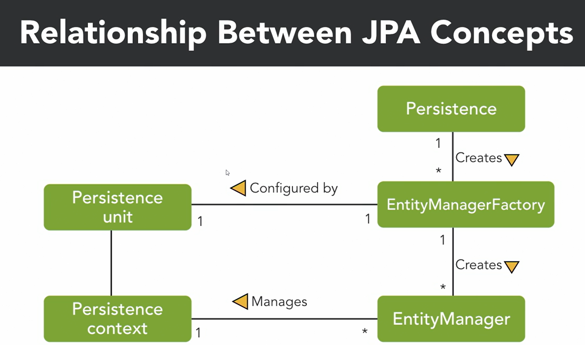
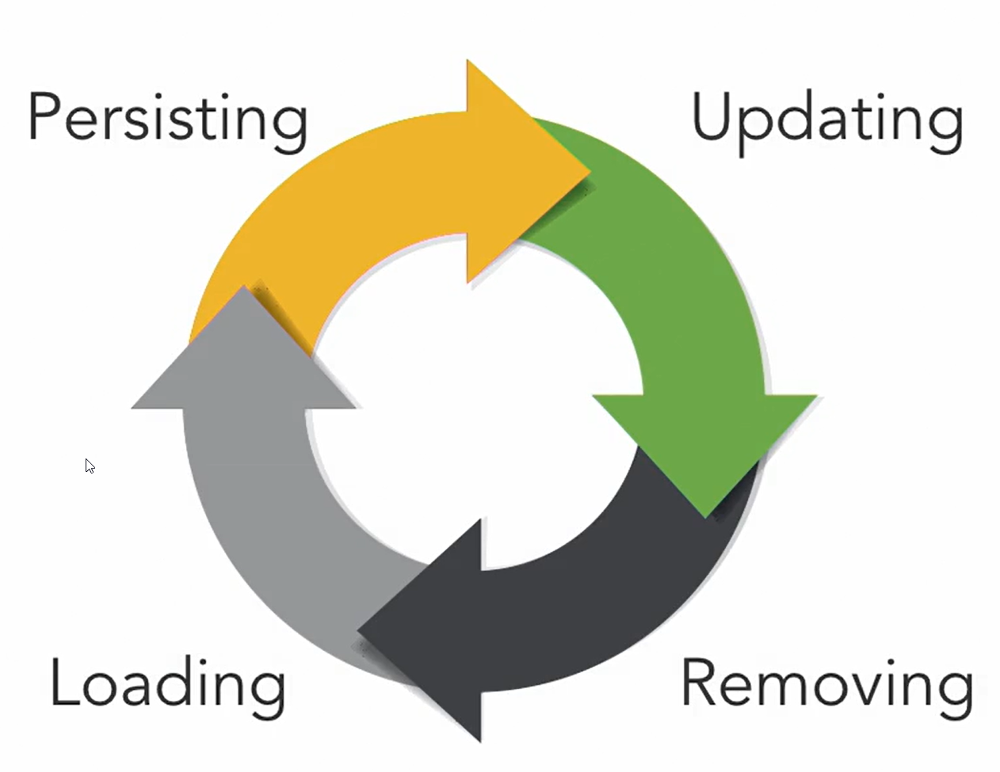
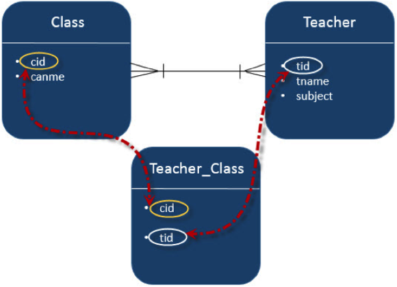
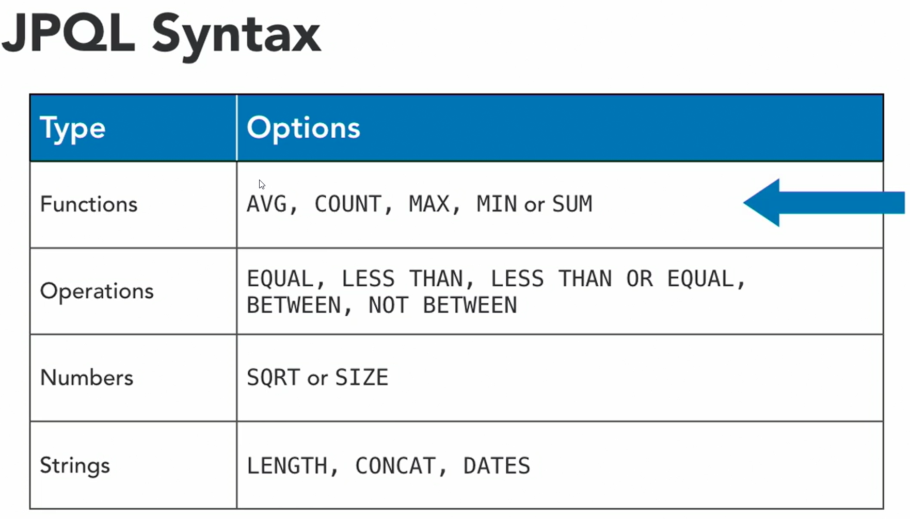

[](index.md) [Go to Contents](index.md)

## Java persistence

1. What is persistence?
   1. Persistence refers to information that continues to exist even after the process
   or application that that created it is no longer running.
   2. Storage options:
      1. Relational DB, NoSQL DB, File System, Disk storage
2. Objrct Relational Mapping (ORM)
   1. Object relational mapping brings relational databases and objects together by bridging the gap between the two technologies so they can talk to each other.
   2. The process of object relational mapping is often delegated to external tools or frameworks. In Java EE, this framework is called Java Persistence, API, JPA.
   3. Benefits
      * Productivity
      * Application Design
      * Clean separation of code
      * Maintenance
3. JPA
   1. There are four implementations of the JPA specification. EclipseLink, Hibernate, OpenJPA and Data Nucleus. ???
4. JPA configuration
   1. There are two ways to define JPA metadata. The most common way is to define it via annotations in the Java class. Alternatively, the metadata can be defined via XML, or a combination of both. The chosen method for this course is annotations. 
   >An important tip to note is that if you use the XML configuration file, it will overwrite any annotations you've provided.
   2. Entity - Entities are objects that live in a database and have the ability to be mapped to a database. Entities are defined by the `@Entity` annotation. Entities support inheritance, relationships, etc., they also have a unique identifier.
5. Benefits of JPA over JDBC
   * **The most obvious benefit of JDBC over JPA is that it's simpler to understand.** On the other side, if a developer doesn't grasp the internal workings of the JPA framework or database design, they will be unable to write good code.
   * Also, JPA is thought to be better suited for more sophisticated applications by many developers. But, JDBC is considered the preferable alternative if an application will use a simple database and we don't plan to migrate it to a different database vendor.
   * The main advantage of JPA over JDBC for developers is that they can code their Java applications using object-oriented principles and best practices without having to worry about database semantics. 
   As a result, **development can be completed more quickly, especially when software developers lack a solid understanding of SQL and relational databases.**
   * Also, because a well-tested and robust framework is handling the interaction between the database and the Java application, we should see a decrease in errors from the database mapping layer when using JPA.
6. Entity Manager
   1. **EntityManager is part of the Java Persistence API. Chiefly, it implements the programming interfaces and lifecycle rules defined by the JPA 2.0 specification.**
   Moreover, we can access the Persistence Context by using the APIs in EntityManager.
   2. 
   3. There are two types of EntityManager: Container-Managed and Application-Managed.
      1. **Container-Managed EntityManager**<br>
         Here, the container injects the EntityManager in our enterprise components.
         In other words, the container creates the EntityManager from the EntityManagerFactory for us:
         ```
         @PersistenceContext
         EntityManager entityManager;
         ```
         This also means **the container is in charge of beginning the transaction, as well as committing or rolling it back**.
         Similarly, the container is responsible for closing the EntityManager, so it's safe to use without manual cleanups. Even if we try to close a container-managed EntityManager, it should throw an IllegalStateException.
      2. **Application-Managed EntityManager**<br>
         Conversely, the lifecycle of the EntityManager is managed by the application.
         In fact, we'll manually create the EntityManager, as well as manage the lifecycle of it.
         ```
         EntityManagerFactory emf = Persistence.createEntityManagerFactory("com.baeldung.movie_catalog");
         ```
         In order to create an EntityManager, we must explicitly call createEntityManager() in the EntityManagerFactory:
         ```
             public static EntityManager getEntityManager() {
                 return emf.createEntityManager();
             }
         ```
         Since we're responsible for creating EntityManager instances, it's also our responsibility to close them. Therefore, we should close each EntityManager when we're done using them.
      3. **Thread-Safety**<br>
         The EntityManagerFactory instances, and consequently, Hibernate's SessionFactory instances, are thread-safe. So it's completely safe in concurrent contexts to write:
         ```
             EntityManagerFactory emf = // fetched from somewhere
             EntityManager em = emf.createEntityManager();
         ```
         On the other hand, the EntityManager instances aren't thread-safe, and are meant to be used in thread-confined environments. This means that each thread should obtain its instance, work with it, and close it at the end.
         When using application-managed EntityManagers, it's easy to create thread-confined instances:
         ```
         EntityManagerFactory emf = // fetched from somewhere
         EntityManager em = emf.createEntityManager();
         // use it in the current thread
         ```
         However, things get counter-intuitive when using container-managed EntityManagers:
         ```
         @Service
         public class MovieService {
   
            @PersistenceContext // or even @Autowired
            private EntityManager entityManager;
       
            // omitted
         }
         ```
         It seems that one EntityManager instance should be shared for all operations. 
         **However, the container (JakartaEE or Spring) injects a special proxy instead of a simple EntityManager here**. Spring, for example, injects a proxy of type SharedEntityManagerCreator.
      
         Every time we use the injected EntityManager, this proxy will either reuse the existing EntityManager or create a new one. Reuse usually occurs when we enable something like Open Session/EntityManager in View.
      
         Either way, **the container ensures that each EntityManager is confined to one thread**.
7. Transaction Management
   1. Entity Life Cycle
      
   2. Entity States
      1. Entity lifecycle in scope of states:
         1. Regular Java Object
         2. Transient or new state (**Before entity is persisted**)
         3. Managed state (After entity was persistent)
         4. Loaded from DB (also considered like persistent)
      2. States:
         1. **Managed** - The entity is under control of EntityManager
            1. It is automatically synchronized after using entity setter methods
         2. **Detached** - The final state for an entity
            1. Detached
            2. Removed
            3. Flushed
            4. Committed
            5. Garbage Collector
   3. Managing transactions
      1. Uses JTA (Java Transaction API)
      2. To use: Add @Entity, Public or protected constructor, don't use final methods or variables.
         Every Entity should have @Id
      3. Default Mapping Rules
         1. Entity is automatically mapped to the table with the same name
         2. Id -> Primary Key
         3. Attributes -> Columns
      4. Mapping Customization
         1. `@Table(name = "table_name")`
         2. `@Column(name = "description", length = 2000)` This is max possible length.
         3. `@Transient `- field is not persistent
8. Relationship Mapping in JPA
   1. Relationships
      1. **@ManyToOne** Relation
         1. Many-To-One relation between entities: Where one entity (column or set of columns) is/are referenced with another entity (column or set of columns) which contain unique values. In relational databases these relations are applicable by using foreign key/primary key between tables.
      2. **@OneToMany** Relation
         1. In this relationship each row of one entity is referenced to many child records in other entity. The important thing is that child records cannot have multiple parents. In a one-to-many relationship between Table A and Table B, each row in Table A is linked to 0, 1 or many rows in Table B.
      3. **@OneToOne** Relation
         1. In One-To-One relationship, one item can belong to only one other item. It means each row of one entity is referred to one and only one row of another entity.
      4. **@ManyToMany** Relation
         1. Many-To-Many relationship is where one or more rows from one entity are associated with more than one row in other entity.
         2. 
      5. **@JoinColumn**
         1. We don't need to use extra table for Joining.
      6. **@JoinTable**
         1. Needs extra table to join.
            <br>A join table is typically used in the mapping of many-to-many and unidirectional one-to-many associations. It may also be used to map bidirectional many-to-one/one-to-many associations, unidirectional many-to-one relationships, and one-to-one associations (both bidirectional and unidirectional).
         2. @JoinColumn vs @JoinTable
            1. @JoinColumn is better for performance
            2. @JoinTable reduces redundancy
   2. Cascading Events
      1. All JPA-specific cascade operations are represented by the javax.persistence.CascadeType enum containing entries:
         1. **ALL** - propagates all operations — including Hibernate-specific ones — from a parent to a child entity.
         2. **PERSIST** - The persist operation makes a transient instance persistent. Cascade Type PERSIST propagates the persist operation from a parent to a child entity. When we save the person entity, the address entity will also get saved.
               ```
               Person person = new Person();
               Address address = new Address();
               address.setPerson(person);
               person.setAddresses(Arrays.asList(address));
               session.persist(person);
               session.flush();
               session.clear();
               ```
         3. **MERGE** - The merge operation copies the state of the given object onto the persistent object with the same identifier. CascadeType.MERGE propagates the merge operation from a parent to a child entity.
         4. **REMOVE** - As the name suggests, the remove operation removes the row corresponding to the entity from the database and also from the persistent context.
            **CascadeType.REMOVE propagates the remove operation from parent to child entity. Similar to JPA's CascadeType.REMOVE, we have CascadeType.DELETE, which is specific to Hibernate.** There is no difference between the two.
         5. **REFRESH** - Refresh operations **reread the value of a given instance from the database**. In some cases, we may change an instance after persisting in the database, but later we need to undo those changes.
            In that kind of scenario, this may be useful. **When we use this operation with Cascade Type REFRESH, the child entity also gets reloaded from the database whenever the parent entity is refreshed.**
         6. **DETACH** - The detach operation removes the entity from the persistent context. **When we use CascadeType.DETACH, the child entity will also get removed from the persistent context**.
9. Entity Inheritance Strategies
   Relational databases don't have a straightforward way to map class hierarchies onto database tables.
   To address this, the JPA specification provides several strategies:
      * **MappedSuperclass** – the parent classes, can't be entities
      * **Single Table** – The entities from different classes with a common ancestor are placed in a single table.
        * Discriminator Values
           Since the records for all entities will be in the same table, Hibernate needs a way to differentiate between them.
           By default, this is done through a discriminator column called DTYPE that has the name of the entity as a value.
           To customize the discriminator column, we can use the @DiscriminatorColumn annotation:
           ```
           @Entity(name="products")
           @Inheritance(strategy = InheritanceType.SINGLE_TABLE)
           @DiscriminatorColumn(name="product_type", discriminatorType = DiscriminatorType.INTEGER)
           public class MyProduct {
              // ...
           }
           ```
           Here we've chosen to differentiate MyProduct subclass entities by an integer column called product_type.
           Next, we need to tell Hibernate what value each subclass record will have for the product_type column:
           ```
           @Entity
           @DiscriminatorValue("1")
           public class Book extends MyProduct {
              // ...
           }
            
           @Entity
           @DiscriminatorValue("2")
           public class Pen extends MyProduct {
              // ...
           }
           ```
           **This strategy has the advantage of polymorphic query performance since only one table needs to be accessed when querying parent entities.**
           On the other hand, this also means that **we can no longer use NOT NULL constraints on subclass** entity properties.
      * **Joined Table** – Each class has its table, and querying a subclass entity requires joining the tables.
      * **Table per Class** – All the properties of a class are in its table, so no join is required.
      Each strategy results in a different database structure.
      **Entity inheritance means that we can use polymorphic queries for retrieving all the subclass entities when querying for a superclass.**
10. Java Persistence Query Language (JPQL)
    1. The JPQL (Java Persistence Query Language) is an object-oriented query language which is used to perform database operations on persistent entities. Instead of database table, JPQL uses entity object model to operate the SQL queries. Here, the role of JPA is to transform JPQL into SQL. Thus, it provides an easy platform for developers to handle SQL tasks.
    2. JPQL is an extension of Entity JavaBeans Query Language (EJBQL), adding the following important features to it: -
       * It can perform join operations.
       * It can update and delete data in a bulk.
       * It can perform aggregate function with sorting and grouping clauses.
       * Single and multiple value result types.
    
    3. Create Complex queries with setParameter
    4. Compile-time named queries
       1. @NamedQuery 
       ```
       @Table(name = "users")
       @Entity
       @NamedQuery(name = "UserEntity.findByUserId", query = "SELECT u FROM UserEntity u WHERE u.id=:userId")
       public class UserEntity {
       
          @Id
          private Long id;
          private String name;
          //Standard constructor, getters and setters.
       }
       ```
       ```
       public UserEntity getUserByIdWithNamedQuery(Long id) {
          Query namedQuery = getEntityManager().createNamedQuery("UserEntity.findByUserId");
          namedQuery.setParameter("userId", id);
          return (UserEntity) namedQuery.getSingleResult();
       }
       ```
    5. Native queries
       1. **A NativeQuery is simply an SQL query. These allow us to unleash the full power of our database, as we can use proprietary features not available in JPQL-restricted syntax.**
       2. This comes at a cost. We lose the database portability of our application with NativeQuery because our JPA provider can't abstract specific details from the database implementation or vendor anymore.
          ```
          public UserEntity getUserByIdWithNativeQuery(Long id) {
             Query nativeQuery
                = getEntityManager().createNativeQuery("SELECT * FROM users WHERE id=:userId", UserEntity.class);
             nativeQuery.setParameter("userId", id);
             return (UserEntity) nativeQuery.getSingleResult();
          }
          ```
          We must always consider if a NativeQuery is the only option. **Most of the time, a good JPQL Query can fulfill our needs and most importantly, maintain a level of abstraction from the actual database implementation.**
    6. Stored procedures
       1. Dynamic Stored Procedure
       2. Declarative named stored procedure
          1. Examples
             ```
             @NamedStoredProcedureQuery(
                name="addEmployeeProcedure",
                procedureName="ADD_EMPLOYEE_PROCEDURE",
                resultClasses = { EmployeeEntity.class },
                parameters={
                   @StoredProcedureParameter(name="firstName", type=String.class, mode=ParameterMode.IN),
                   @StoredProcedureParameter(name="lastName", type=String.class, mode=ParameterMode.IN),
                   @StoredProcedureParameter(name="email", type=String.class, mode=ParameterMode.IN),
                   @StoredProcedureParameter(name="departmentId", type=Integer.class, mode=ParameterMode.IN)
                }
             )
             public class EmployeeEntity implements Serializable
             {
                //More code
             }
             ```
             ```
             @Override
             public boolean addEmployee(String firstName, String lastName, String email, Integer departmentId) {
                ProcedureQuery storedProcedure = manager
                   .createNamedStoredProcedureQuery("ADD_EMPLOYEE_PROCEDURE");

                storedProcedure.setParameter(0, firstName)
                    .setParameter(1, lastName)
                    .setParameter(2, email)
                    .setParameter(3, departmentId);

                storedProcedure.execute();
 
                return true;
             }
             ```
    7. Query using streams
       1. **getResultStream()** instead of **getResultList()**
          It reduces the amount of memory consumption and query calls to a database.
          Because of that, it's also much faster.
          Processing data with a Stream requires us to close a Stream when we finish it.
          It can be done by calling the close() method on a Stream or by using try-with-resources
11. Criteria API
    1. The Criteria API is a predefined API used to define queries for entities. It is the alternative way of defining a JPQL query. These queries are type-safe, and portable and easy to modify by changing the syntax. Similar to JPQL it follows abstract schema (easy to edit schema) and embedded objects. The metadata API is mingled with criteria API to model persistent entity for criteria queries.
    2. The major advantage of the criteria API is that errors can be detected earlier during compile time. String based JPQL queries and JPA criteria based queries are same in performance and efficiency.
12. Persistence Providers
    1. Hibernate, EclipseLink, OpenJPA and DataNucleus
    
    
         


## Questions

1. Difference Between save() and saveAndFlush() in Spring Data JPA
   1. Normally, Hibernate holds the persistable state in memory. The process of synchronizing this state to the underlying DB is called flushing.
   2. When we use the save() method, **the data associated with the save operation won't be flushed to the DB unless, and until, an explicit call to the flush() or commit() method is made.**
   3. If we use JPA implementations like Hibernate, then that specific implementation will be managing the flush and commit operations.
   4. Unlike save(), the saveAndFlush() method **flushes the data immediately during the execution**.<br>
      Normally, we use this method when our business logic needs to read the saved changes at a later point during the same transaction, but before the commit.
2.