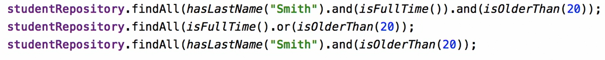

[](index.md) [Go to Contents](index.md)

## Spring Data

1. Spring Data Commons
2. Logical model vs. physical model
3. Map DB tables to Java classes
4. JPQL
5. Spring Data Repository interfaces
   1. To create a custom repository, we have to extend it to any of the following interfaces:
      * Repository
        ```
        public interface UserRepository extends Repository<User, Long> {
           List<User> findByEmailAddressAndLastname(String emailAddress, String lastname);
        }
        ```
      * PagingAndSortingRepository
        ```
        @Repository
        public interface EmployeeRepository extends PagingAndSortingRepository<EmployeeEntity, Long> {
        }
      * CrudRepository
        ```
        public interface UserRepository extends CrudRepository<User, Long>  {
        }
        ```
      * JpaRepository
        ```
        public interface UserRepository extends JpaRepository<User, Long> {
        }
        ```
      * QueryByExampleRepository
        ```
        public interface JpaRepository<T, ID> extends PagingAndSortingRepository<T, ID>, QueryByExampleExecutor<T> {}
        ```
6. Querying with Spring Data
   1. @Query. It is possible to query even not a repository model object
      >Select new CourseView() from Course where c.id = ?1
   2. Paging and Sorting
      1. Add parameter Pageable
      2. Or add PageRequest.of(0,4,Sort.Direction.ASC,"credits, "name")
         1. 0 - The page number
         2. 4 - size of page
         3. Sort ascending by credits and then by name
      3. Use PagingAndSortingRepository (extends CrudRepository)
   3. QueryByExample
      1. >JpaRepository<Department, Integer> extends QueryByExampleExecutor<Department>
         <br>public interface DepartmentRepository- extends JpaRepository<Department, Integer> {}
      2. We can use Example.of(T probe)
      3. We can add ExampleMatcher to Example.of(new Object, ExampleMatcher)
   4. Optional<> query response
7. Spring Data Mongo
   1. Unlike JPA, Mongo DB does not permit joined queries
8. Spring Data Reactive repository
   1. in contrast to the traditional repository interfaces, a reactive repository uses reactive types as return types and can do so for parameter types, too. The CRUD methods in the newly introduced ReactiveCrudRepository, of course make use of these types, too.
   2. Mongo, Cassandra, Redis, Couchbase
   3. ReactiveCrudRepository
   5. Mono, Flux 
9. Other Spring Data datasource solutions
   1. Spring Data Gemfire
   2. Spring Data Key Value
   3. Spring Data Redis
   4. Spring Data LDAP
   5. Spring Data for Apache Cassandra
   6. Spring Data for Apache Solr
   7. Community Modules
      1. Spring Data module for Aerospike
      2. Spring Data module for Couchebase
   8. Spring Data JDBC Extensions
   9. Spring Data for Apache Hadoop
10. Spring Data Rest
    1. Spring Data REST builds on top of Spring Data repositories, analyzes your application’s domain model and exposes hypermedia-driven HTTP resources for aggregates contained in the model.
    2. Features
       * Exposes a discoverable REST API for your domain model using HAL as media type.
       * Exposes collection, item and association resources representing your model.
       * Supports pagination via navigational links.
       * Allows to dynamically filter collection resources.
       * Exposes dedicated search resources for query methods defined in your repositories.
       * Allows to hook into the handling of REST requests by handling Spring ApplicationEvents.
       * Exposes metadata about the model discovered as ALPS and JSON Schema.
       * Allows to define client specific representations through projections.
       * Ships a customized variant of the HAL Explorer to leverage the exposed metadata.
       * Currently supports JPA, MongoDB, Neo4j, Solr, Cassandra, Gemfire.
       * Allows advanced customizations of the default resources exposed.
11. QueryDSL Spring Data extension
    1. Example 
       
12. Auditing
    1. Implements Auditable<U, PK> interface
    2. AbstractAuditable extends Auditable
    3. AuditorAware - extract user in Spring Security
13. Read-only repository pattern
    1. @NoRepositoryBean


### Questions

1. What is the Spring data repository? (answer)
   1. Answer: Spring data repository is a very important feature of JPA. It helps in reducing a lot of boilerplate code. Moreover, it decreases the chance of errors significantly. This is also the key abstraction that is provided using the Repository interface. It takes the domain class to manage as well as the id type of the domain class as Type Arguments.
2. What is the naming convention for finder methods in the Spring data repository interface?
   1. Answer:  This is another key feature of Spring Data JPA API which makes writing query method really easy. The finder method should use a special keyword, i.e. "find", followed by the name of the variable. For example, findByLastName().
3. Is the CrudRepository interface part of JPA?
   1. No. CrudRepository is an interface exposed by Spring Data framework for more easily interacting with JPA implementations like Hibernate. While this interface saves a lot of boilerplate code, it isn't part of the JPA specification.
4. How can we create a custom repository in Spring data JPA?
   1. Answer: To create a custom repository, we have to extend it to any of the following interfaces:
      a) Repository
      b) PagingAndSortingRepository
      c) CrudRepository
      d) JpaRepository
      e) QueryByExampleRepository
5. What is PagingAndSortingRepository?
   1. Answer: The PagingAndSortingRepository provides methods that are used to retrieve entities using pagination and sorting. It extends the CrudRepository interface.
6. Differentiate between findById() and getOne().
   1. Answer: The findById() is available in CrudRepository while getOne() is available in JpaRepository. The findById() returns null if record does not exist while the getOne() will throw an exception called EntityNotFoundException.
7. What is the difference between Spring Data JPA and Hibernate?
   1. Spring Data JPA provides an abstraction for more easily working with a JPA provider like Hibernate.
8. Is Spring Data JPA an implementation of the JPA specification?
   1. No. Spring Data simply makes it easier to interface with a JPA specification like Hibernate. Spring Data JPA abstracts away a lot of the configuration associated with these implementations but is not an implementation itself.
9. What's the difference between a CrudRepository and JpaRepository in Spring Data JPA?
   1. CrudRepository extends REpository interface. JpaRepostitory extends PagingandSortingRepository interface. CrudRepository is for CRUD methods only where batch operations are better handled by extending JpaRepository.
10. How does the CrudRepository save() method work in Spring Data JPA
    1. The save() method effectively "upserts" a record. If the record doesn't exist in the database, then persist() is called. If the record does exist, then merge() is called to perform an update.
11. What is the difference between CrudRepository, JpaRepository, and PagingAndSortingRepository interfaces in Spring Data JPA?
    1. JpaRepository extends PagingAndSortingRepository which in turn elongates CrudRepository.
       Their main functions are:
       * CrudRepository mainly provides CRUD functions.
       * PagingAndSortingRepository provides methods to do pagination and sorting records.
       * JpaRepository contains the full API of CrudRepository and PagingAndSortingRepository. So it contains API for basic CRUD operations and also API for pagination and sorting.


