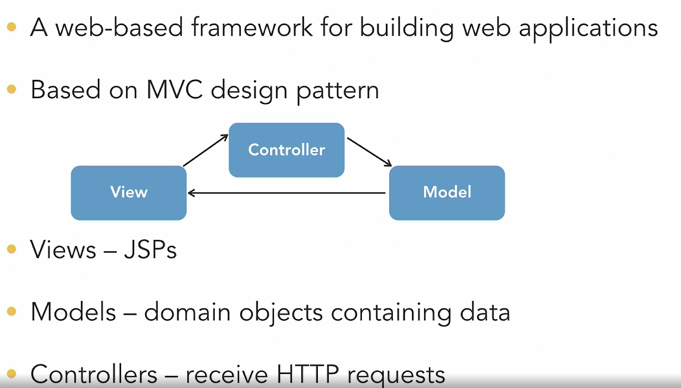
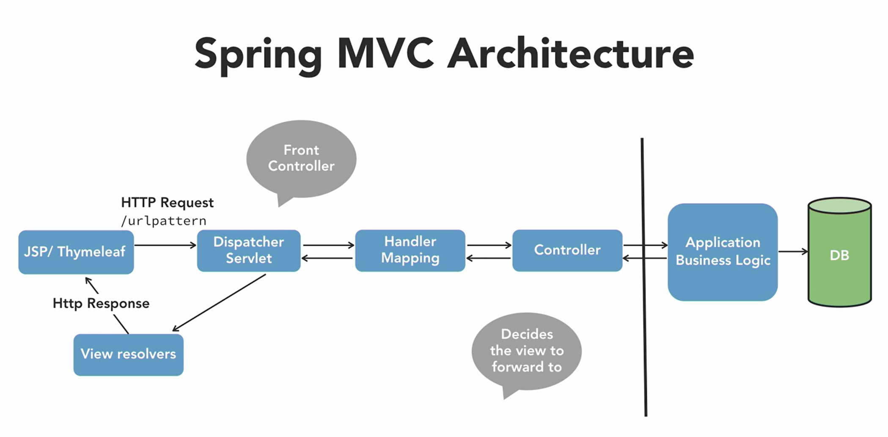
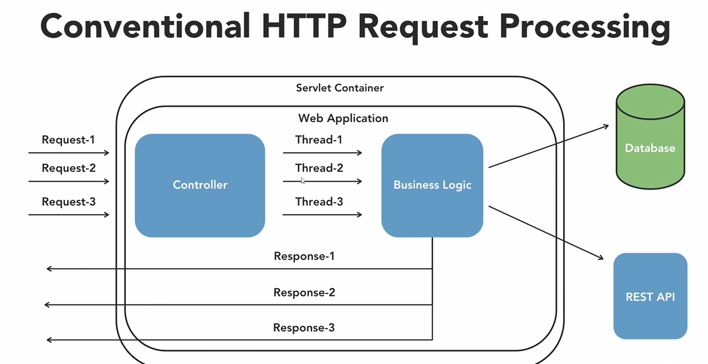
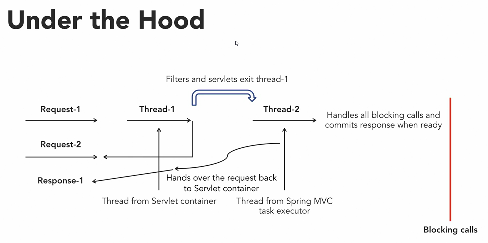
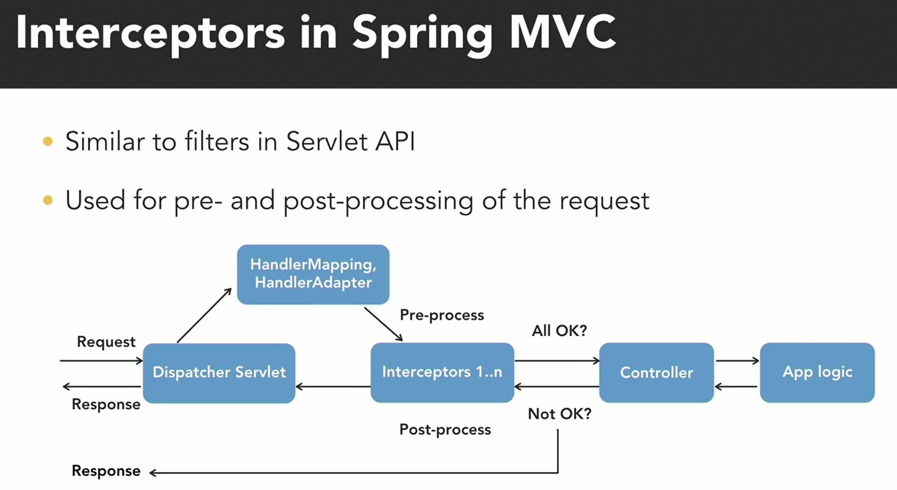
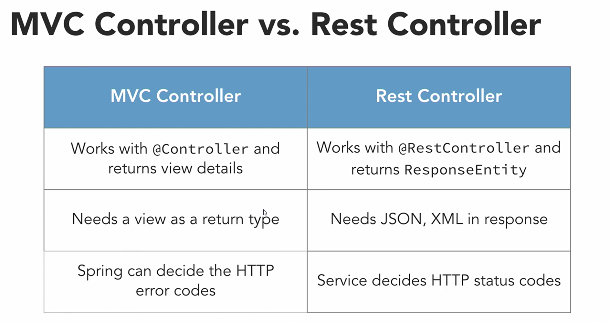

[](index.md) [Go to Contents](index.md)

## Spring MVC

1. Intro
   1. Why to use Spring MVC?
      * IOC - 
      * AOP
      * JPA
      * Quite mature and stable with loads of support online
      * Vs Spring Boot:
        * Promoting separation of concerns - it's great way to develop modular web applications
        * Abstracts away the tedious and boilerplate tasks of handling HTTP requests
        * Excellent support for developing RESTful web services
   2. Features
      1. Build on top of Servlet API
      2. Convention over configuration
      3. Clear distinction between all components (M-V-C)
      4. POJO based, light weight development
      5. High level of possible customization
      6. Does not couple tightly with any one view of technology
      7. Provides to develop RESTful web services as well
   3. Spring MVC Architecture
      1. 
   4. Folders and static files
      1. Where we keep static files?
         1. `resources` folder
      2. Why do we need to use `webapp` and `WEB-INF` folder?
         1. Because we are using WAR deployment to Tomcat and this is required in this case.
   5. Java configuration for Spring MVC
      1. Add the Java configuration to bootstrap `DispatvherServlet` class\
         [**DispatcherServlet** Introduction](https://www.baeldung.com/spring-dispatcherservlet)
         * `DispatcherServlet` - A central dispatcher for HTTP request handlers/controllers, e.g. for web UI controllers or HTTP-based remote service exporters. Dispatches to registered handlers for processing a web request, providing convenient mapping and exception handling facilities.
         * Basically the `DispatcherServlet` is the entry point of every Spring MVC application. Its purpose is to intercept HTTP requests and to dispatch them to the right component that will know how to handle it.
         * `WebApplicationInitializer` -
           Interface to be implemented in Servlet 3.0+ environments in order to configure the ServletContext programmatically -- as opposed to (or possibly in conjunction with) the traditional web.xml-based approach.
           Implementations of this SPI will be detected automatically by SpringServletContainerInitializer, which itself is bootstrapped automatically by any Servlet 3.0 container. See its Javadoc for details on this bootstrapping mechanism.
           ```
           public class MyWebAppInitializer implements WebApplicationInitializer {
              @Override
              public void onStartup(ServletContext container) {
                 AnnotationConfigWebApplicationContext context
                    = new AnnotationConfigWebApplicationContext();
                 context.setConfigLocation("com.example.app.config");

                 container.addListener(new ContextLoaderListener(context));

                 ServletRegistration.Dynamic dispatcher = container
                    .addServlet("dispatcher", new DispatcherServlet(context));
        
                 dispatcher.setLoadOnStartup(1);
                 dispatcher.addMapping("/");
              }
           }
           ```
           `LoadOnStartup` - the priority of instantiating and initialization of the servlet(-1 will be lazy loading)
         * [`WebMvcConfigurationSupport`](https://docs.spring.io/spring-framework/docs/current/javadoc-api/org/springframework/web/servlet/config/annotation/WebMvcConfigurationSupport.html) \
           This is the main class providing the configuration behind the MVC Java config. It is typically imported by adding [`@EnableWebMvc`](https://docs.spring.io/spring-framework/docs/current/javadoc-api/org/springframework/web/servlet/config/annotation/EnableWebMvc.html) \
           to an application `@Configuration` class. An alternative more advanced option is to extend directly from this class and override methods as necessary, remembering to add `@Configuration` to the subclass and `@Bean` to overridden `@Bean` methods. For more details see the javadoc of `@EnableWebMvc`.\
           This class registers: `HandlerMappings, HandlerAdapter, HandlerExceptionResolverComposite, AntPathMatcher and a UrlPathHelper`
         * [View Resolver](https://www.baeldung.com/spring-dispatcherservlet#3-the-viewresolver-interface)
           * A ViewResolver is attached to a DispatcherServlet as a configuration setting on an ApplicationContext object.\
             **A ViewResolver determines both what kind of views are served by the dispatcher and from where they are served.**
   6. Controllers
      1. Return view name
      2. **So for example if the Controller returns a view named “welcome”, the view resolver will try to resolve a page called “welcome.jsp” in the WEB-INF folder**.
   7. What is the standard practice to run spring boot application with JSP support in embedded Tomcat?
      1. eg go to Maven, go to spring-boot plugin, launch run task
      2. using `java -jar /target/...jar` is not good practice
   8. Basic Annotations/Objects for controllers
      1. @RequestParam - used to receive request params
      2. Model/ModelMap - used afor store the info for your views
      3. ModelAndView - allow to hold the name of the view and model with data itself
      4. @ModelAttribute - used to annotate parameters for data binding. **@ModelAttribute is an annotation that binds a method parameter or method return value to a named model attribute, and then exposes it to a web view.**
   9. Access data from Model
      1. `model.addAttribute("products", products);` 
      2. Show on JSP, Use JSTL core library
      3. Add taglib to JSP `<%@ taglib prefix="c" uri="http://java.sun.com/jsp/jstl/core" %>`
      4. eg `<c:if test="${!empty(products)}">...</c:if>`
      5. use this tag for iterating via array: `<c:forEach var="product" items="${products}">...</c:forEach>`
      6. use value `${product.name}`
   10. Using `@ModelAttribute` 
       1. Add to controller parameter `@ModelAttribute("newUser" User user)`
       2. Add `modelAttribute="newUser"` to form on jsp `<form method="post" action="#" modelAttribute="newUser" >`
       3. Parameter name like `newUser` should be on the both sides to bind
       4. add form tags from taglib `<%@ prefix="form" uri="..." %>`
       5. use like `<form:form ....`, `form:input name=".." ...`
   11. How to map jsp form with Controller?
       1. We have to use form tag with `action="/createuser"`, value inside action should be the same as used in
          Controller `@RequestMapping("/createuser")` or in `@PostMapping("/createuser")`
2. Data Validation and Binding
   1. Why are validation needed?
   2. Client side validation?
   3. How to validate on backend?
      1. The Spring Validator interface for application specific objects
      2. JSR 380 Bean Validation API is the standard, goes well with Spring 5.1
         1. It can be done by adding JSR 380 to @Entity, eg `@Size(min=6, max=90, message="Invalid value")`,
            `@Pattern(regexp = "")`, `@NotNull(message="fg")`
         2. We can enable controller parameter validation by adding `@Valid` before the parameter in method
         3. Attach `BindingResult` parameter to method(tight after the binded parameter)
         4. Plug in Springs's form tag on JSP to display error message `<form:errors path="username" />`
         5. Localize error messages for validations from .properties file `ValidationMessages.properties`,\
            `@NotEmpty(message="{username.not.empty})` from added property file.
            1. Why do we need to localize messages?
   4. Binders
      1. `@InitBinder`
         ```
         @InitBinder
         public void initBinder(WebDataBinder binder) {
            binder.registerCistomEditor(Data.class, "dataOfBirth", new CustomDateEditor(new SimpleDateFormat("yyy-MM-dd")));
         ```
   5. Converters
      1. Why do we need convertors
      2. Have to implement Converter<Source, Target>
      3. We have to override `addFormatters(FormatterRegistry registry)` method in AppConfig class:
         ```
         @Override
         protected void addFormatters(FormatterRegistry registry) {
            registry.addConverter(new StringToEnumConverter());
         }
         ```
3. Exception Handling
   1. DispetcherServlet and special bean types
      1. HandlerMapping - maps request to handler
      2. HandlerAdapter - invokes the handler
      3. HandlerExceptionResolver - helps with exception handling
      4. ViewResolver = helps resolve views
      5. LocalResolver - helps for l10n and i18n support
      6. ThemeResolver - helps with stylized look and feel
   2. Exception flow
      1. Handled by `DispetcherServlet`
      2. Delegates to HandlerExceptionResolver beans
      3. What does exception handling mean in an application?
         1. Spring MVC provides exception handling for your web application to make sure you are sending your own exception page instead of the server-generated exception to the user.
      4. Wy is it needed?
         1. It is more convenient to see well formatted understandable message than Stacktrace
      5. Types
         1. `ExceptionHandlerExceptionResolver` - define exception handler methods in controllers
         2. `SimpleMAppingExceptionResolver` - map each exception class with an error page
         3. `DefaultHandlerExceptionResolver` - default which maps exceptions to error code
         4. `ResponseStatusExceptionResolver` - resolves custom exception using status code defined in `@ResponseStatus`
      6. Create custom error page
      7. Disable the default whitelabel error page
      8. Solution 1: the Controller-Level @ExceptionHandler
         1. The first solution works at the @Controller level. We will define a method to handle exceptions and annotate that with @ExceptionHandler:
            ```
            public class FooController{

               //...
               @ExceptionHandler({ CustomException1.class, CustomException2.class })
               public void handleException() {
                  //
               }
            }
            ```
            This approach has a major drawback: **The @ExceptionHandler annotated method is only active for that particular Controller**, not globally for the entire application. Of course, adding this to every controller makes it not well suited for a general exception handling mechanism.
            We can work around this limitation by having **all Controllers extend a Base Controller class**.
      9. Solution 2: the HandlerExceptionResolver
         1. `ExceptionHandlerExceptionResolver` This resolver was introduced in Spring 3.1 and is enabled by default in the DispatcherServlet. This is actually the core component of how the @ExceptionHandler mechanism presented earlier works.
         2. `DefaultHandlerExceptionResolver`   This resolver was introduced in Spring 3.0, and it's enabled by default in the DispatcherServlet.
            1. It's used to resolve standard Spring exceptions to their corresponding HTTP Status Codes, namely Client error 4xx and Server error 5xx status codes. Here's the full list of the Spring Exceptions it handles and how they map to status codes.
               While it does set the Status Code of the Response properly, one limitation is that it doesn't set anything to the body of the Response. And for a REST API — the Status Code is really not enough information to present to the Client — the response has to have a body as well, to allow the application to give additional information about the failure.
               This can be solved by configuring view resolution and rendering error content through ModelAndView, but the solution is clearly not optimal. That's why Spring 3.2 introduced a better option that we'll discuss in a later section.
         3. `ResponseStatusExceptionResolver` Its main responsibility is to use the @ResponseStatus annotation available on custom exceptions and to map these exceptions to HTTP status codes.
         4. `Custom HandlerExceptionResolver` 
      10. Solution 3: `@ControllerAdvice`
          1. Spring 3.2 brings support for a global @ExceptionHandler with the @ControllerAdvice annotation.
          2. The@ControllerAdvice annotation allows us to consolidate our multiple, scattered `@ExceptionHandlers` from before into a single, global error handling component.
          3. Features:
             * It gives us full control over the body of the response as well as the status code.
             * It provides mapping of several exceptions to the same method, to be handled together.
             * It makes good use of the newer RESTful ResposeEntity response.
      11. Solution 4: ResponseStatusException (Spring 5 and Above)
          1. Spring 5 introduced the ResponseStatusException class.
             We can create an instance of it providing an HttpStatus and optionally a reason and a cause:
             ```
             @GetMapping(value = "/{id}")
             public Foo findById(@PathVariable("id") Long id, HttpServletResponse response) {
                try {
                   Foo resourceById = RestPreconditions.checkFound(service.findOne(id));
                      eventPublisher.publishEvent(new SingleResourceRetrievedEvent(this, response));
                      return resourceById;
                   }
                   catch (MyResourceNotFoundException exc) {
                      throw new ResponseStatusException(
                      HttpStatus.NOT_FOUND, "Foo Not Found", exc);
                   }
                }
             }
             ```
   3. Async Request Processing
      1. Conventional HTTP request processing
         1. 
      2. Spring MVC async processing under the hood
         1. Integrated with Servlet 3.0
         2. Separate threads for request allocation and blocking calls
         3. Enable the async processing for Spring MVC
         4. Let controllers return either of the following:
            1. Callable<T>
            2. DeferredResult<T>
         5. 
      3. Async configuration
         1. Set async processing flag on DispatcherServlet (By default it is enabled in Spring Boot)
         2. Add async processing configuration in WebConfig if needed
            ```
            @Override
            protected void configureAsyncSupport(AsyncSupportConfigurer configurer) {
               //eg setTimeout 
               configurer.setTaskExecutor(mvcTaskExecutor());
            }
            
            @Bean 
            public AsyncTaskExecutor mvcTaskExecutor() {
               ThreadPoolTaskExecutor tpte = new ThreadPoolTaskExecutor();
               tpte.setThreadNamePrefix("ourapp-thread-");
               return tpte;
            }
            ```
         3. Return a Callable<String>/DeferredResult<String> from Controllers
      4. Return callable in Controller
         1. Return type Callable<String>
         2. inside controller return comething callable, eg lambda, you can see that threads in controller
            method and in lambda will be different.
      5. DefferedResult implementation for async
         1. Add `AsyncTaskExecutor` and return deferred result which will be filled with the result inside executor.
         2. **Callable allows to return a value, while Runnable does not. DeferredResult is a class designed by Spring to allow more options (that I will describe) for asynchronous request processing in Spring MVC, and this class just holds the result (as implied by its name) while your Callable implementation holds the async code.**
   4. ViewResolvers
      1. What are view resolver?
         1. Any MVC framework needs to render data in browsers
         2. Works with 2 interfaces
            1. View
            2. ViewResolver
         3. Types of view resolvers
            1. `InternalResourceViewResolver` - eg maps jsp folder and file extensions 
            2. `ResourceBundleViewResolver` - maps resources, eg property files
            3. `XmlViewResolver`
            4. `VelocityViewResolver`/`FreeMarkerViewResolver`
      2. Using `XmlViewResolver`
         1. **The XmlViewResolver is used to resolve the view names using view beans defined in xml file.**
         2. A ViewResolver implementation that uses bean definitions in a dedicated XML file for view definitions, specified by resource location. The file will typically be located in the WEB-INF directory; the default is "/WEB-INF/views.xml"
      3. Using `ResourceBundleViewResolver`
         1. The ResourceBundleViewResolver is used to resolve the view names using view beans defined in the properties file.
         2. views.properties
            ```
            hello.(class) = org.springframework.web.servlet.view.JstlView
            hello.url = /WEB-INF/jsp/hello.jsp
            ```
      4. Chaining view resolvers
         1. Application can configure multiple view resolvers
         2. Set order on each of then using setOrder API
         3. Higher the order value, the later that view resolver is placed in the chain
   5. Interceptors and Themes
      1. Intro to interceptors
         1. Similar to filter in Servlet API
         2. Used for pre- and post-processing of the request
         3. 
      2. Built-in and custom interceptors
         1. Implementations of `HandlerInterceptorAdapter`
            1. preHandle
            2. postHandle
            3. afterCompletion - after response is committed
         2. `ThemeChangeInterceptor`
         3. `LocaleChangeInterceptor`
   6. Spring MVC REST Controllers
      1. RESTful services recap
         1. Access resources on the web
         2. Actions with simple and well-defined operations
         3. Promotes interoperability between systems
         4. Works with HTTP protocols:
            1. GET - retrieve resources
            2. POST - update resources
            3. PUT - insert resources
            4. DELETE - removes resources
         5. Data Transfer in REST
            1. XML/JSON used to transfer data between client and server
            2. JSON vs. XML
               1. XML is strict
               2. JSON is convenient and lightweight
               3. JSON needed for AJAX designs
            3. Spring MVC MarshallingView for XML response to be rendered (through JAXB)
            4. Spring MVC HttpMessageConvertors for JSON (Jakson by default)
            5. No view name needed. Rest Controllers just return data.
      2. Use `@Controller` abd `@ResponseBody`
         1. `@ResponseBody` - says to Spring to represent the result as the Body of the response 
      3. Use `@RequestController` and `@ResponseEntity`
         1. `@RestController` combines `@Controller` abd `@ResponseBody` together
         2. `@ResponseEntity` - information sent back to client about the request
            1. ResponseEntity represents the whole HTTP response: status code, headers, and body. As a result, we can use it to fully configure the HTTP response.
               If we want to use it, we have to return it from the endpoint; Spring takes care of the rest.
               ResponseEntity is a generic type. Consequently, we can use any type as the response body:
      4. Use `@PathVariable` and `@RequestParam` to get request payload
         1. @PathVariable value should match the value from @GetMapping
            ```
            @GetMapping("/app/order/{id}")
            public ResponseEntity getOrderById(@PAthVariable("id") Integer id) {
               Order order = orderRepository.findById(id);
               return ResponseEntity<>(order, HttpStatus.OK);
            }
            ```
      5. Use `@RequestBody` and `@ResponseEntity`
         1. @RequestBody - represents request body
         2. ```
            @PostMapping("/app/loginuser")
            public ResponseEntity loginUser(@RequestBody Login login) {
               sout(login.getUsername());
               //get user from repository
               if (user == null) {
                  return ResponseEntity.status(404).build();
               }
               // etc
            }
            ```
      6. Use `@ExceptionHandler`
         1. 
      7. MVC bs REST controllers
         1. 
               
    