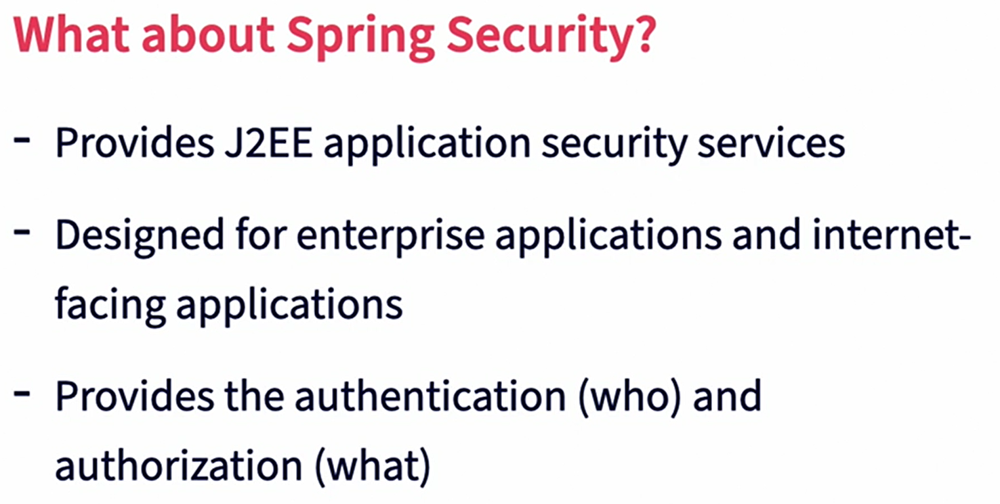

 [Go to Contents](index.md)

## Spring Security

1. Authentication vs. Authorization
   1. Authentication
      1. Process of verifying a principal
      2. Principal can be humans or machines
      3. Spring provides such authentications:
         1. HTTP basics
         2. Digest
         3. x509
         4. Form-based authentication
         5. LDAP and Active directory
         6. OpenID
         7. Jasig CAS(Central authentication Service)
         8. JAAS
         9. Kerberos and SAML
   2. Authorization
      1. Determines what the principal can or cannot do
      2. Authorization is based on authentication
      3. Authorization is often called access control
      4. Supported Types
         1. Web request based authorization
         2. Method invocation security
         3. Domain object access control
2. Securing Web application
   1. In-memory authentication
      1. Never should be used in the real world
      2. InMemoryUserDetailsManager is used as UserDetailsService
   2. JDBC authentication
      1. JdbcUserDetailsManager is used as UserDetailsService
   3. Leveraging bcrypt for hashing
      1. You should never store passwords in plain text
      2. You should never encrypt your user's password
      3. You SHOULD use cryptographically sound one-way hash
      4. Don't use SHA256, it can be brute forced attacked by high performance GPUs
      5. Default hash algorithm is BCrypt
      6. Question: What bean is created to adjust the password encoder? (The default behavior is B-Crypt.)
         1. A: PasswordEncoder
   4. Applying authorization
   5. Form-based authentication
      1. Session based with no logoff support
      2. No real security implications, assuming TLS is used
      3. Features
         1. Allows you to customize the form
         2. Allows for a more seamless view in your application
         3. Provides "Remember Me" options
         4. Provides logout
      4. Steps to implement
         1. Create login form
         2. Implement controller and wiring
         3. Turn it on and test
3. LDAP authentication
   1. Intro
      1. LDAP - Lightweight Directly Access Protocol
         1. User directory structure
         2. Built into many operating systems
         3. Interoperability
         4. Scalability
      2. Spring Security LDAP
         1. -spring-security-ldap project
         2. Full support for native LDAP operations
         3. Password-hashing algorithms included
      3. Paradigm
         1. Very similar to basic and form based authentication
         2. Leverages `AuthenticationManagerBuilder` in the same manner
      4. Internal LDAP
         1. Use embedded LDAP
         2. Can use OpenLDAP if you prefer
         3. Active Directory is not LDAP, but can use LDAP for authentication
      5. LDAP use cases
         1. Not uses of LDAP are security related
      6. LDAP Operations
         1. Query LDAP (filters)
         2. Search and Dynamic DN creation
         3. Binding, update and delete
         4. Repository pattern is also exists
      7. Active Directory vs. LDAP authentication
         1. Active directory is not LDAP
         2. AD implements LDAP API
         3. AD provides more services
         4. AD supports Nested groups, bur Spring LDAP by default is not supporting it
         5. Spring Security uses `ActiveDirectoryLdapAuthenticationProvider` for AD
   2. Questions
      1. Which object is configured for enabling Spring LDAP integration?
         1. A: `AuthenticationManagerBuilder`
      2. Why is LDAP a critical integration point for Spring Security?
         1. A:
            * It is lightweight.
            * It exists natively on many operating systems.
            * Active Directory from Microsoft has a compatible API.
4. OAuth 2 with Spring Security
   1. Intro into Auth 2
      1. Protocol and framework for providing access to HTTP services
      2. Often used for third-party access
      3. Can be used for system-to-system communications in standalone or on behalf of a user
   2. Parts of Auth 2
      1. Resource owner - often a user
      2. Client - application requesting access
      3. Resource server - posts protected data and accounts
      4. Authorization service - service that grants tokens
      5. Token Types
         1. Access token - the secret and often short-lived token that identifies a user
         2. Refresh token - longer-lived token used to renew access token when it expires
         3. Scopes provide for rights associated with the access token
      6. Grants
         1. Several grant types that impact flows
         2. Authorization code grant is most common
         3. Implicit grant is common in web apps and mobile apps
         4. Client credentials grant is useful in system-to-system communications
   3. Spring and OAuth 2
      1. `CommonOAuth2Provider`
         1. Provides native support for Okta, Google, GitHub, and Facebook
         2. Property-based configuration in Spring Boot
         3. Client-side OAuth integration
      2. Authorization Server
         1. Provides authorization services to the system
         2. `@EnableAuthorizationServer`
         3. AuthorizationServerConfigurerAdapter used to configure it
         4. Support various grant types
      3. Resource- Server
         1. Provides the resources being protected
         2. `@EnableResourceServer`
      4. OAuth 2 Client
         1. Full client-side support
         2. `@EnableOauth2Client`
         3. `Oauth2RestTemplate` provides much of the scaffolding
         4. Support various grant types
   4. Questions:
      1. Which two pieces of information are needed from GitHub to enable integration?
         1. A: client ID and client secret
5. WebFlux Security
   1. Intro to WebFlux
      1. `@EnableWebFluxSecurity`
      2. Basic config maps everything to security
      3. `SecurityWebFilterChain` provides more fine-grained control
      4. `MapReactiveUserDetailsServices` provides handle to `UserDeatialsServices`
   2. Principal
      1. Security model still based on principal
      2. Inject `Mono<Principal>` into methods where you want handle it
      3. Still provides core functionality
   3. Questions:
      1. What is the annotation for using Spring Security with reactive endpoints?
         1. `@EnableWebFluxSecurity`
      2. Which bean provides access to the User Details Service?
         1. `MapReactiveUserDetailsService`
