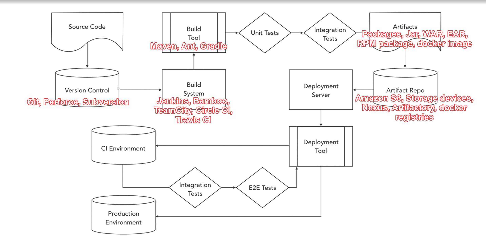
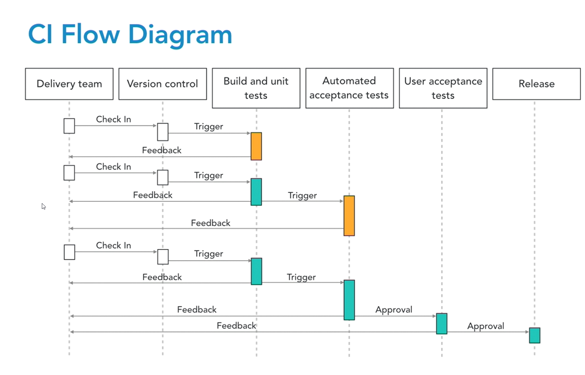

 [Go to Contents](index.md)

## Build Tools

### Continuous Delivery/Continuous Integration

**Continuous integration** - The practice of automatically building and unit testing an entire application frequently, ideally on every source code check-in.

**Continuous delivery** - The practice of deploying every build to a production-like environment and performing automated integration and acceptance testing.

**Continuous deployment** - The practice of automatically deploying every build to production after it passes its automated tests

Benefits: 
* Empowering Teams - makes the process of software delivery transparent and understandable to the entire team
* Lowered Cycles Times - This is a time from code commit to running in production.
* Rhythm of Practice - The rhythm of Continuous Delivery removes stress from teams, both in development and operations. No longer a release date's a stressful event.
* More time to be productive - 

### Build pipeline
A build pipeline is your sequence of operations and the tools that perform them between your source code and your deployed system.

### Version Control Practices
- Always use version control
- Commit often
- Use easy to understand commit messages
- Don't commit broken code
- Consider using master branch approach
- Using feature flags
- Commit hooks enforce quality
- Be careful with secrets

### Continuous Integration Systems
- Start with clean environment
- Build to pass the coffee test

###### A CI Culture
- Run tests locally before committing
- Don't commit new code to broken builds
- Don't leave the build broken
- Don't remove tests that fails

###### Use notifications to update your build progress
### Building artifacts
- Benefits
  - Reliability
  - Composability - Компонуемость:
    

      
Click to view description

      Packaging can provide dependency management between your code and its dependencies and between it and other pieces of software. This is a good reason to use a common packaging format that supports dependency definition like debs or RPMs. In many cases you don't have just one kind of technology, so consider wrapping up different technologies in a common packaging format. For example at work we package our Java jars, puppet code, rules files, infrastructure definitions, etc., all into Debian packages so we can manage them in the same way and define version dependencies among both them and the third party packages we consume as part of our built systems.
    

  - Security
    - Permissions who can write to repository(CI tool)
  - Shareability - Easy to consume
###### Artifact Repositories
  - Nexus (2 and 3)
  - JFrog Artifactory
  - Apache Archive
  - And many more
  
### Testing and Continuous Delivery
- Good Tests:
  - Are fast
  - Are reliable
  - Isolate failures for you
- Types of Testing
  - Unit testing -  unit testing is performed at build time on a single unit of code and or artifact without the use of external dependencies or deployment
  - Integration testing - is performed as you bring together pieces of your application and as it needs to use external dependencies like databases to actually do its thing
  - UI testing - End-to-end testing, often implemented as UI testing is when you test more of your application in a way that the end user actually uses it.(Selenium)
  - Security testing -  Looks for flaws in your code and the runtime to prevent compromises and leaking of data in production. Some common tools for this include FindBugs, Fortify, and Gauntlt.
- Terminology
  - **Shift left** - is a terms that's become popular for moving testing as much to the beginning, the front in a normal left to right software build pipeline flow diagram as possible.
  - **Test fixtures** - are a set of objects used to run a test in a well-known environment.
  - **System under test**, or the **SUT**, that's QA lingo for the thing that you're testing
  - **Cycle time** - is how long it takes from when someone starts working on an item to its production deployment.
  - **Lead time** - time from when something's requested all the way to when it's done.
  - **Mock** - simulate using external libraries instead of really using them 
- Testing philosophy
  - **Test-driven development** (TDD) - The practice of writing a failing test first, and then writing the code that causes the test to pass
  - **Behavior-driven development** (BDD) - The practice of writing tests in a simple end-user-behavior-centric language (Cucumber)
    - Benefits for non-technical users
  - Acceptance test-driven development - The practice of agreeing of acceptance tests before development to establish what is to be delivered
- Metrics to track
  - Cycle time - time from the start of work to delivery
  - Velocity - value delivered per unit time
  - Customer satisfaction - hew well a product/service met the customer's needs. NPC scores and bug reports work well here.

### Application deploy and release
- Deploy with:
  - The same artifact
  - The same way
  - The same (similar) environment
  - The same smoke tests
- Separate Deploy and Release
  - Blue/Green deployments
  - Feature flags
  - Canary deployment

