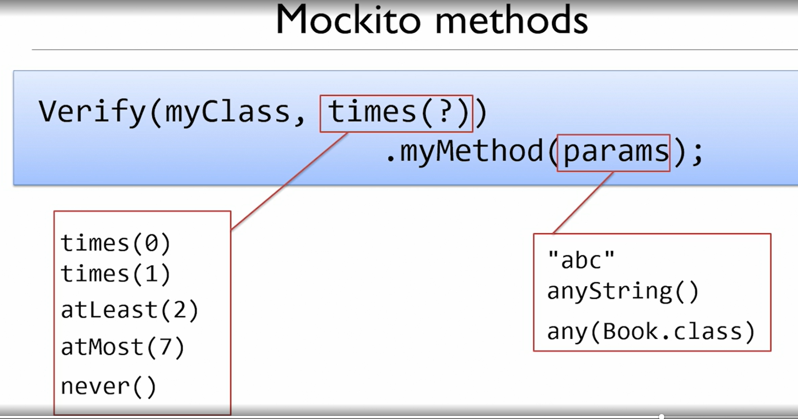

[](index.md) [Go to Contents](index.md)

## Unit Testing and Mocking

### Test-Driven Development
Many people associate TDD with Agile.
### What is TDD?
Test drive the code.

1. A New test initially fails
2. We work to get the test to pass
3. We finally optimise our code, and tests
### What to test?

- Each test will cover a single piece of logic
  - Each test will cover a single scenario for a single piece of logic

### Rules of TDD
- Test the expected outcome of an example
- Don't pre-judge design... let your tests drive it
- Write the minimum code required to get your tests to pass
- Each test should validate one single piece of logic

### Best practices
- test one item of functionality only
- test business logic, not methods
- test must be repeatable, and consistent

###### What tests should I write?
- What should the logic be?
- What is the opposite to that logic?
- Are there any edge cases?
- Are there any error conditions?

### Stubs
A stub is a fake class that comes with preprogrammed return values. It's injected into the class under test to give you absolute control over what's being tested as input. A typical stub is a database connection that allows you to mimic any scenario without having a real database.

### Mocking with Mockito
- Stub: A class or object that implements the methods of the class/object to be faked and returns always what you want.
- Mock: The same of stub, but it adds some logic that "verifies" when a method is called so you can be sure some implementation is calling that method.
---
- Fake: Fakes are objects that have working implementations, but not the same as production one. Such as: in-memory implementation of Data Access Object or Repository.
- Stub: Stub is an object that holds predefined data and uses it to answer calls during tests. Such as: an object that needs to grab some data from the database to respond to a method call.
- Mocks: Mocks are objects that register calls they receive. In test assertion, we can verify on Mocks that all expected actions were performed. Such as: a functionality that calls e-mail sending service.

###### Mockito:
```
MyClass myClass = mock(MyClass.class);
when(myClass.myMethod(params)).thenReturn(return-value);

verify(myClass, times(?)).myMethod(params);
```


### Fakes and Tautologies

@Before, setUp() - runs before each test method in class
tearDown() - runs after each method in class

#### Spy
```
spyClassObject = spy(new SpyClass());
doReturn(value).when(spyClassObject).callMethod();
```


