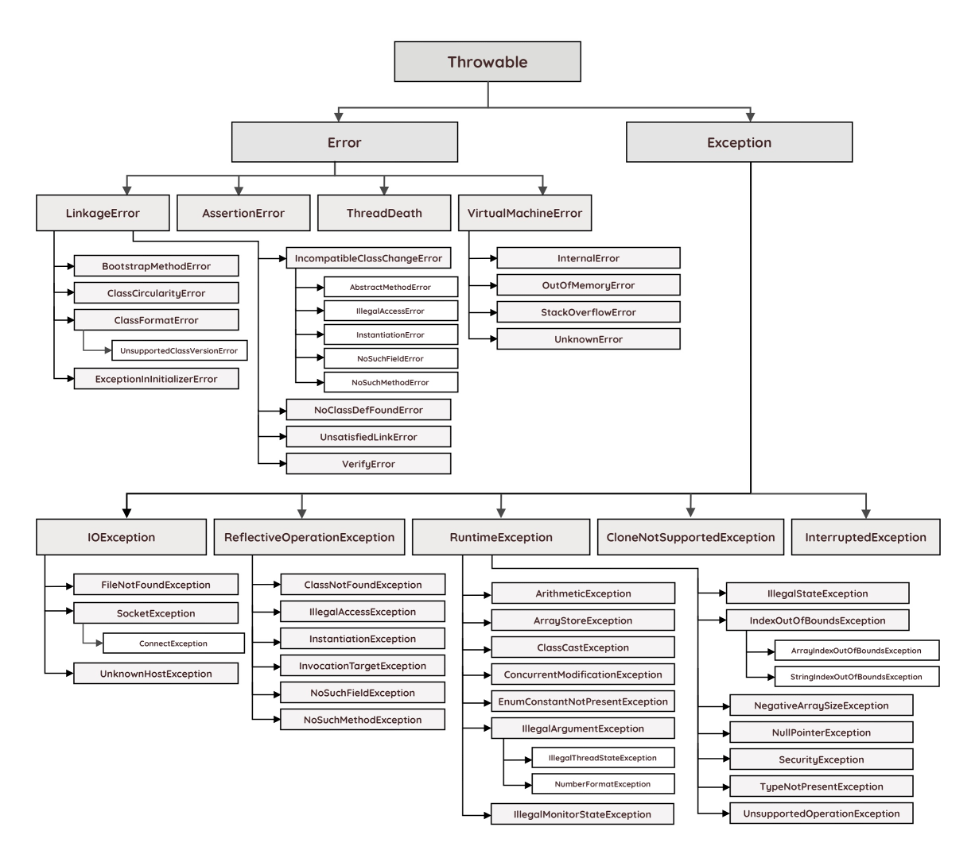
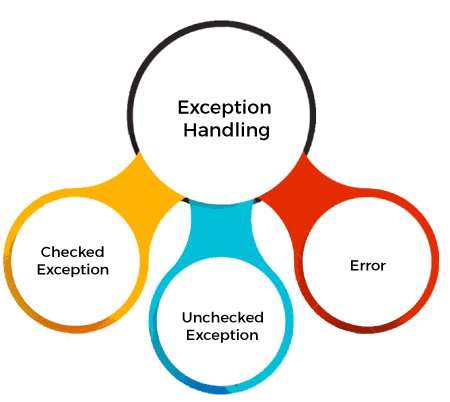

[](index.md) [Go to Contents](index.md)


1. What is the access modifiers? What do you know? Can you describe them?
2. Where can we put final keyword?
3. What could it be if we put the final keyword before the class?
4. Java Exceptions Hierarchy
   1. 
   2. Types of Exceptions
      <br>Java defines several types of exceptions that relate to its various class libraries. Java also allows users to define their own exceptions.
      
   3. 
5. What different types of exceptions do we have in Java?
   1. There are mainly two types of exceptions: checked and unchecked. An error is considered as the unchecked exception. However, according to Oracle, there are three types of exceptions namely:
      * Checked Exception
      * Unchecked Exception
      * Error
   
6. what 2 ways of exceptions handling do we have? (Propogations?)
7. How can we close the file after using?
8. If we open file, open chanel, read, then do close, what will happen? (Whon't be closed)
9. Closable interface?
10. Where to use LinkedList and where to use ArrayList?
11. Where to use hashCode and equals methods?
12. What is the contract between hashCode and equals?
13. ConcurrentModificationException?
14. What is the deadlock?
15. How to prevent the deadlock?
16. What do notify and wait methods?
17. Show code example and ask about checking deadlocks or other issue with resources.
18. Question about incrementing with different threads.
#### OOP
18. What is the encapsulation?
19. What is the polymorphism?
20. What is the difference between abstract class and interface?
21. Ask to write code as example of overriding methods and shows polymorphism.
#### Patterns
21. What is the builder pattern? And question about 5 or 12 parameters in constructor, Is this good candidate for constructor?
22. What is the decorator pattern? Write an example.
#### Tests
23. What makes our tests good?
24. 
25. What is mock and how can we use it?
#### Data transformation

See questions on appropriate page
---------
26. What does http request contain?
27. What 3 layers are we using in the application?
28. What is the servlet?
29. What is the transaction in the relational DB?
30. SQL, Spring
---------------
31. Coding task
    ```
    Method that checks if the array of ints is splittable to two parts at some index, so that that the both parts have the same sum of elements.
    ○ [4, 3, 2] -> false
    ○ [1, 2, 3] -> true
    ```

32. What is the time complexity of this method? O square
33. Is this treadsafe code?
34. What is kept in Stack and what in the Heap?
    Multiple trads have multiple Stacks but shares the same Heap
35. Write the Unit Test for the provided code.
36. How can we show first 2 lines in file in linux? (head -n 2)
37. What is the branch in git?
38. What operations can we do with branch?
39. What is the cherry-pick?
40. When do we have the merge conflict?